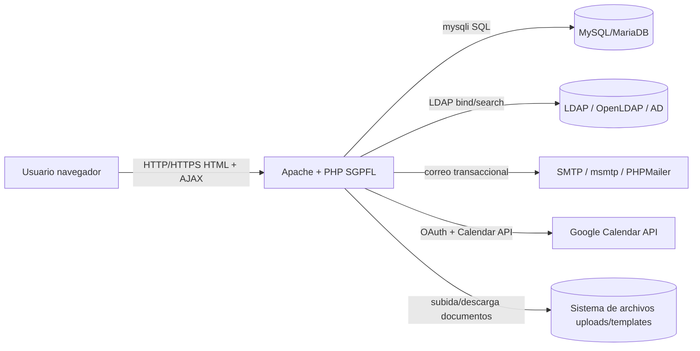
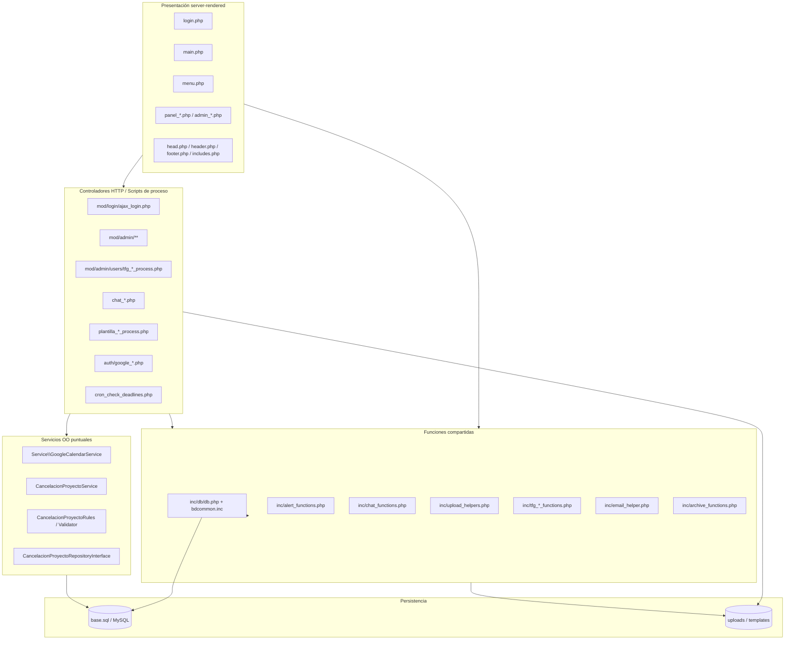
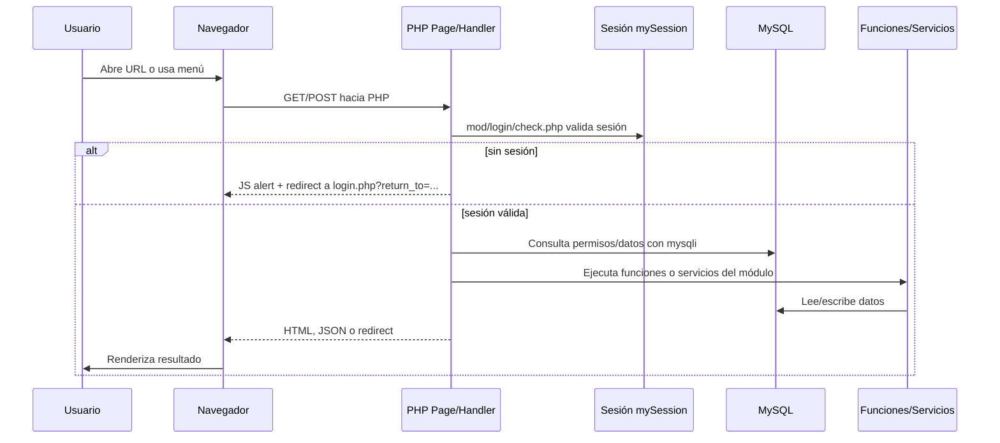
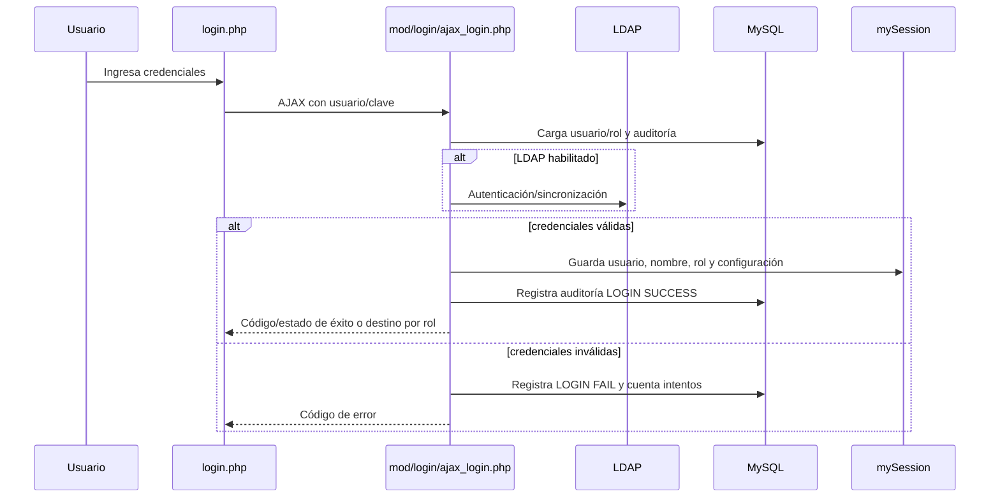
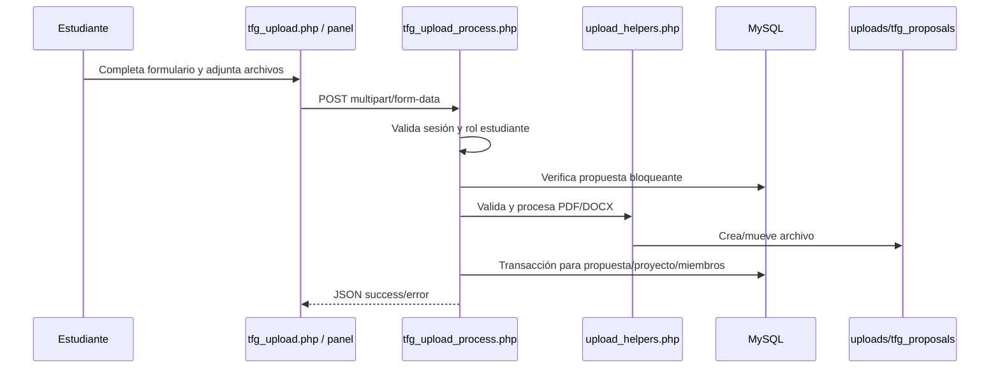
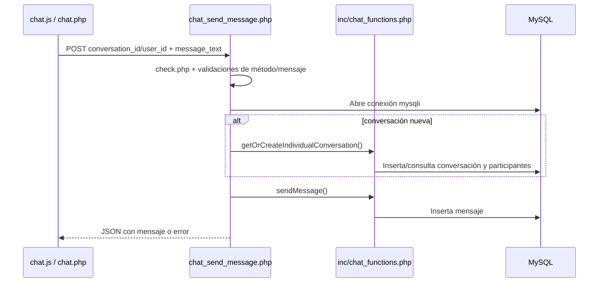
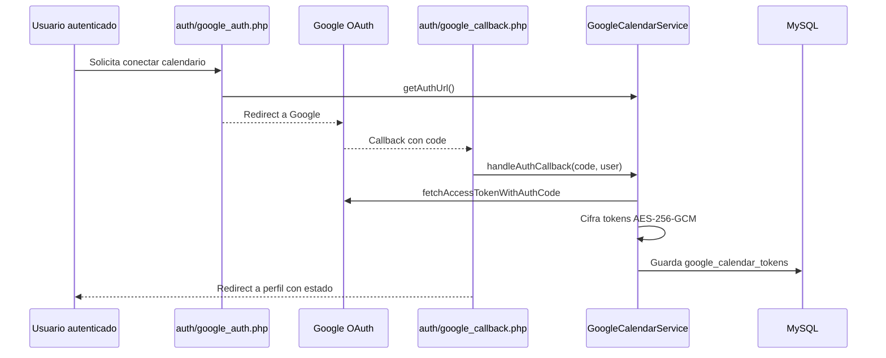

# Arquitectura real del sistema SGPFL

**Sistema:** SGPFL — Sistema Gestor de Proyectos Finales de Licenciatura  
**Etapa del manual:** Prompt 2 de 5 — Identificación y documentación de arquitectura real  
**Fecha de levantamiento:** 2026-05-06  
**Fuente:** inspección directa del repositorio local `/workspace/SGPFL`

---

## 1. Diagnóstico arquitectónico breve

SGPFL no implementa una arquitectura MVC estricta, una API REST completa ni Clean Architecture como estilo dominante. La arquitectura real es un **monolito PHP server-rendered, modular por páginas y carpetas funcionales**, con persistencia MySQL, autenticación local/LDAP, sesiones propias, autorización por roles/permisos, frontend integrado en PHP y servicios desacoplados solo en partes puntuales.

La forma más precisa de describir el sistema es:

> **Monolito web PHP con arquitectura por capas parcial y módulos funcionales legacy/evolutivos.**

El sistema mezcla varios estilos:

- **Page Controller / Transaction Script:** páginas PHP y scripts `*_process.php`, `ajax_*.php`, `chat_*.php` reciben la petición, validan, consultan BD, ejecutan reglas y responden HTML/JSON/redirecciones.
- **Server-side rendering:** HTML generado por PHP con includes compartidos.
- **AJAX parcial:** navegación interna y endpoints JSON puntuales, sin contrato REST formal.
- **Capa de funciones compartidas:** `inc/` concentra lógica reutilizable para alertas, chat, documentos, uploads, TFG y correo.
- **Servicios orientados a objetos puntuales:** `service/` contiene casos más cercanos a aplicación/dominio, especialmente Google Calendar y cancelación de proyectos.
- **Capa de datos híbrida:** uso de `mysqli` directo, funciones globales de BD y consultas preparadas en varios módulos.

---

## 2. Clasificación de estilos arquitectónicos

| Estilo evaluado | ¿Aplica? | Evidencia | Conclusión |
|---|---:|---|---|
| MVC clásico | Parcial/no dominante | Hay páginas que mezclan vista, controlador, consultas y reglas. No existe separación consistente `Controller/Model/View`. | No documentar como MVC formal. |
| API REST | No dominante | Existen endpoints AJAX JSON, pero no hay versionado `/api`, recursos REST, verbos HTTP consistentes ni contratos. | Documentar como endpoints AJAX/procesos HTTP. |
| Arquitectura por capas | Parcial | Presentación PHP, scripts controladores, funciones `inc/`, servicios `service/`, BD MySQL. Las fronteras no son estrictas. | Sí, pero como capas pragmáticas, no puras. |
| Clean Architecture | Puntual | `CancelacionProyectoService` usa interfaz de repositorio, validador y reglas; no es patrón generalizado. | Solo aplicar a módulos nuevos o refactors. |
| Monolito modular | Sí | La aplicación vive bajo `base/` y se separa por carpetas/páginas/módulos funcionales. | Es la descripción principal. |
| Separación frontend/backend | No estricta | Frontend y backend comparten PHP, includes, JS/CSS locales y páginas server-rendered. | No existe frontend independiente. |
| Service Layer | Parcial | `GoogleCalendarService` y servicios de cancelación encapsulan lógica. | Útil como patrón objetivo gradual. |
| Repository Pattern | Puntual | `CancelacionProyectoRepositoryInterface` existe como contrato. | No generalizado en el sistema. |

---

## 3. Vista de contexto del sistema

SGPFL opera como una aplicación web PHP servida por Apache. El navegador consume páginas HTML generadas en servidor y realiza llamadas AJAX hacia scripts PHP. La aplicación consulta MySQL, autentica/sincroniza contra LDAP cuando corresponde, envía correos por SMTP/PHPMailer/msmtp y se integra con Google Calendar mediante OAuth.



### Responsabilidades externas

| Componente | Responsabilidad |
|---|---|
| Navegador | Renderiza HTML, ejecuta JS local, dispara navegación AJAX y formularios. |
| Apache/PHP | Ejecuta aplicación, sesiones, controladores/páginas, reglas, integración y render. |
| MySQL/MariaDB | Persistencia de usuarios, permisos, proyectos, documentos, chat, alertas, auditoría y tokens. |
| LDAP | Autenticación/sincronización de usuarios institucionales o entorno local de desarrollo. |
| SMTP/msmtp/PHPMailer | Envío de correos de notificación, recuperación y procesos académicos. |
| Google Calendar | Autorización OAuth y sincronización de eventos de calendario. |
| Sistema de archivos | Almacenamiento de uploads, plantillas, documentos temporales y recursos estáticos. |

---

## 4. Diagrama sugerido de componentes internos



---

## 5. Flujo general de petición/respuesta

### 5.1 Flujo general autenticado HTML/AJAX



### 5.2 Flujo de login



### 5.3 Flujo de carga de propuesta TFG



### 5.4 Flujo de endpoint AJAX de chat



### 5.5 Flujo OAuth de Google Calendar



---

## 6. Responsabilidades por capa real

| Capa real | Rutas/archivos | Responsabilidad | Observación crítica |
|---|---|---|---|
| Presentación | `login.php`, `main.php`, `panel_*.php`, `admin_*.php`, `head.php`, `header.php`, `footer.php`, `includes.php` | Renderizar HTML, cargar CSS/JS, construir pantallas y formularios. | En varias páginas también hay lógica de negocio/BD. |
| Navegación cliente | `inc/js/main.js`, `inc/js/*.js`, `chat.js` | Cargar contenido por AJAX, validaciones UI, interacción de formularios. | La función `OpcionMenu` implementa navegación parcial sin router formal. |
| Controladores HTTP | `mod/login/ajax_login.php`, `chat_*.php`, `plantilla_*`, `mod/admin/users/*process*`, `auth/*.php` | Recibir peticiones, validar método/datos, orquestar sesión, llamadas a BD/funciones/servicios y responder. | La mayoría son Transaction Scripts con responsabilidades amplias. |
| Seguridad transversal | `mod/login/check.php`, `functions.php`, `config.inc`, `lib/mysession` | Validar sesión, cargar rol, verificar permisos por módulo/acción, redirigir no autenticados. | Autorización distribuida; no existe middleware central framework-style. |
| Funciones compartidas | `inc/alert_functions.php`, `inc/chat_functions.php`, `inc/tfg_*`, `inc/upload_helpers.php`, `inc/email_helper.php` | Reutilizar reglas, consultas y utilidades por dominio funcional. | Algunos archivos combinan reglas de negocio con SQL y formato de respuesta. |
| Servicios OO | `service/GoogleCalendarService.php`, `service/cancelaciones/*` | Encapsular integraciones/casos de uso con mayor cohesión. | Patrón prometedor pero no aplicado uniformemente. |
| Persistencia | `inc/db/db.php`, `inc/db/bdcommon.inc`, `mysqli` directo, `base.sql` | Conexión MySQL, consultas, transacciones y esquema. | Hay coexistencia de SQL concatenado y prepared statements. |
| Infraestructura | `docker/`, `ldap-docker/`, `.htaccess`, `PLAN_DEPLOYMENT.md` | Runtime Apache/PHP/MySQL/LDAP/SMTP, límites, HTTPS y despliegue. | Entorno local y producción deben documentarse por separado. |

---

## 7. Patrones usados en el código

### 7.1 Patrones confirmados

| Patrón | Uso real | Ejemplos |
|---|---|---|
| Page Controller | Una página PHP coordina una pantalla o flujo. | `login.php`, `main.php`, `panel_subir_propuesta_tfg.php`, `admin_usuarios.php`. |
| Transaction Script | Un script ejecuta un caso completo de validación + BD + respuesta. | `tfg_upload_process.php`, `plantilla_upload_process.php`, `chat_send_message.php`. |
| Include/Shared Functions | Funciones globales reutilizadas por módulos. | `functions.php`, `inc/chat_functions.php`, `inc/alert_functions.php`. |
| Service Layer parcial | Clases encapsulan operaciones complejas. | `GoogleCalendarService`, `CancelacionProyectoService`. |
| Repository Interface puntual | Contrato para persistencia de cancelaciones. | `CancelacionProyectoRepositoryInterface`. |
| Guard/Access Check | Inclusión de `mod/login/check.php` al inicio de páginas protegidas. | `main.php`, `chat_send_message.php`, `auth/google_auth.php`. |
| Active Record no formal / SQL manual | Los scripts consultan tablas directamente con SQL. | Uso extendido de `mysqli` y consultas preparadas/manuales. |
| Server-side rendering | HTML producido por PHP. | `panel_*.php`, `admin_*.php`, `login.php`. |

### 7.2 Patrones ausentes o no consistentes

| Patrón | Estado | Comentario |
|---|---|---|
| Router central | Ausente | Las rutas son archivos PHP físicos. |
| Controladores MVC dedicados | Ausente/no dominante | No hay carpeta/controladores estándar ni acciones formales. |
| Modelos de dominio persistentes | Ausente/no dominante | Las tablas se manipulan mediante arrays, SQL y funciones. |
| DTOs/ViewModels | Ausentes/no dominantes | Los datos fluyen como arrays asociativos, `$_POST`, `$_FILES`, `$_SESSION`/mySession. |
| Middleware framework-style | Ausente | La protección se realiza por includes manuales. |
| Migraciones versionadas | Parcial | Hay SQL principal e incrementales, pero no sistema formal de migraciones. |
| API REST versionada | Ausente | Existen endpoints JSON pero no contrato REST uniforme. |

---

## 8. Evaluación formal: MVC, REST, Clean Architecture y monolito

### 8.1 ¿Es MVC?

No en sentido formal. Hay elementos parecidos a vistas y controladores, pero las fronteras se cruzan constantemente:

- Las páginas PHP renderizan HTML y también incluyen lógica de control.
- Los scripts de proceso consultan BD directamente.
- No hay modelos de dominio consistentes.
- `inc/` contiene funciones de negocio y persistencia mezcladas.

**Conclusión:** puede explicarse como **Page Controller + vistas PHP**, no como MVC.

### 8.2 ¿Es API REST?

No como arquitectura global. Hay scripts JSON/AJAX, pero:

- No existe prefijo `/api` ni versionado.
- No se observan recursos REST consistentes.
- Algunos endpoints aceptan solo POST, otros GET, otros redirigen o imprimen HTML.
- Las respuestas combinan HTML, JSON, códigos simples y redirecciones.

**Conclusión:** documentar como **endpoints HTTP/AJAX internos**, no como REST API pública.

### 8.3 ¿Tiene arquitectura por capas?

Sí, pero parcial y pragmática. Se distinguen capas reales:

1. Presentación PHP/HTML.
2. Scripts controladores/procesos.
3. Funciones compartidas por dominio.
4. Servicios OO puntuales.
5. Acceso a datos MySQL.
6. Integraciones externas.

**Conclusión:** describir como **arquitectura por capas parcial dentro de un monolito**.

### 8.4 ¿Tiene Clean Architecture?

Solo en partes puntuales. El módulo de cancelaciones es el ejemplo más cercano porque separa servicio, validador, reglas e interfaz de repositorio. Sin embargo, la mayoría del sistema depende de `mysqli`, includes globales, variables globales y arrays.

**Conclusión:** Clean Architecture es un **patrón objetivo para refactors**, no el estado actual del sistema.

### 8.5 ¿Es monolito modular?

Sí. Esta es la definición principal:

- Un único despliegue PHP bajo `base/`.
- Una base de datos principal.
- Módulos funcionales por páginas/carpetas.
- Integraciones externas desde el mismo runtime.
- Frontend y backend en el mismo código.

**Conclusión:** SGPFL es un **monolito modular PHP server-rendered**.

---

## 9. Fortalezas arquitectónicas

| Fortaleza | Impacto positivo |
|---|---|
| Monolito simple de desplegar | Menos componentes que coordinar; útil para equipos pequeños o entornos institucionales. |
| Módulos funcionales identificables | `mod/`, `inc/`, `service/` y páginas `panel_*` permiten ubicar funcionalidades. |
| Uso de variables de entorno en configuración clave | BD, LDAP y Google Calendar pueden configurarse por entorno. |
| Existencia de prepared statements en módulos críticos | Reduce riesgo cuando se usan correctamente. |
| Servicios OO puntuales | `GoogleCalendarService` y cancelaciones muestran una ruta de mejora mantenible. |
| Pruebas unitarias/integración/funcionales existentes | Hay base para refactor incremental con menor riesgo. |
| Documentación operativa previa | Existen manuales y documentos para Docker, LDAP, Google Calendar, cron y despliegue. |
| Docker local | Facilita reproducibilidad para app y MySQL; LDAP tiene entorno separado. |

---

## 10. Deuda técnica y riesgos arquitectónicos

| Riesgo/deuda | Impacto real | Prioridad | Recomendación |
|---|---|---:|---|
| SQL concatenado coexistiendo con prepared statements | Riesgo de SQL injection y mantenimiento difícil. | Alta | Prohibir SQL concatenado en código nuevo y migrar gradualmente a prepared statements/repositorios. |
| Lógica mezclada en páginas PHP | Cambios pequeños pueden romper vista, reglas y persistencia a la vez. | Alta | Extraer casos nuevos a servicios/funciones con pruebas. |
| Autorización distribuida por includes | Es fácil olvidar `check.php` o validación de rol en un endpoint nuevo. | Alta | Crear helper/middleware procedural central para exigir sesión+rol+permiso. |
| CORS abierto en login | `Access-Control-Allow-Origin: *` en autenticación aumenta superficie de ataque. | Alta | Restringir origen o eliminar si no es necesario. |
| Respuestas heterogéneas | Dificulta consumo frontend, pruebas y manejo de errores. | Media | Estandarizar JSON para endpoints AJAX y redirects para páginas. |
| Dependencia de rutas físicas | Renombrar archivos rompe navegación y permisos. | Media | Crear mapa de rutas interno o constantes por módulo. |
| Librerías embebidas y `vendor/` en repo | Dificulta auditoría, actualización y control de vulnerabilidades. | Media | Definir política de dependencias y reproducibilidad por Composer. |
| Sin migraciones formales | Riesgo de drift entre entornos. | Alta | Introducir migraciones incrementales controladas sin reescritura total. |
| Variables globales/config compartida | Acoplamiento fuerte, efectos colaterales y pruebas más difíciles. | Media | Encapsular configuración nueva en objetos/arrays inyectables. |
| Frontend acoplado a HTML PHP | Dificulta evolución hacia API o SPA. | Baja/media | No migrar a SPA por defecto; primero estabilizar endpoints y contratos. |

---

## 11. Recomendación de arquitectura objetivo incremental

No recomiendo una reescritura completa. Sería riesgosa y probablemente innecesaria. La ruta profesional es una **modernización incremental dentro del monolito**.

### 11.1 Decisión recomendada

Mantener SGPFL como monolito PHP, pero evolucionarlo hacia:

- **Monolito modular con capas más explícitas.**
- **Endpoints AJAX con contratos JSON uniformes.**
- **Servicios de aplicación para casos de uso nuevos o modificados.**
- **Repositorios o gateways de datos para módulos críticos.**
- **Prepared statements obligatorios.**
- **Validadores reutilizables para inputs y archivos.**
- **Pruebas unitarias para reglas y pruebas de integración para flujos críticos.**

### 11.2 Capas objetivo propuestas

```text
base/
├── pages/ o paneles actuales       # Presentación PHP existente, sin mover todo al inicio
├── mod/                            # Controladores actuales; refactor gradual
├── inc/                            # Helpers compartidos legacy y utilidades
├── service/                        # Casos de uso nuevos/refactorizados
├── repository/                     # Nueva capa gradual para persistencia crítica
├── validation/                     # Validadores reutilizables nuevos
├── tests/                          # Pruebas existentes y nuevas
└── sql/                            # Migraciones incrementales controladas
```

> Nota: esta estructura es una dirección de evolución, no una instrucción de mover carpetas masivamente en una sola iteración.

### 11.3 Regla práctica para cambios nuevos

Todo desarrollo nuevo debería seguir esta cadena:

```text
Página/Formulario PHP
  -> Script controlador pequeño
    -> Validador explícito
      -> Servicio de aplicación
        -> Repositorio/función segura con prepared statements
          -> MySQL
```

---

## 12. Ejemplo de patrón recomendado para futuros módulos

Este ejemplo es conceptual y debe adaptarse a las convenciones reales del repositorio.

```php
// controlador_ajax.php
include("mod/login/check.php");
require_once __DIR__ . '/service/MiCasoDeUsoService.php';
require_once __DIR__ . '/repository/MiRepositorioMysql.php';

header('Content-Type: application/json; charset=utf-8');

if ($_SERVER['REQUEST_METHOD'] !== 'POST') {
    http_response_code(405);
    echo json_encode(['ok' => false, 'error' => 'Método no permitido']);
    exit;
}

$service = new MiCasoDeUsoService(new MiRepositorioMysql($conn));
$result = $service->ejecutar($_POST, $mySessionController->getVar('usuario'));

http_response_code($result['ok'] ? 200 : 400);
echo json_encode($result, JSON_UNESCAPED_UNICODE);
```

**Criterios obligatorios para nuevos módulos:**

- Validar método HTTP.
- Validar sesión y autorización de rol/permiso.
- No concatenar SQL con datos de usuario.
- Responder JSON uniforme en endpoints AJAX.
- No mezclar HTML dentro de scripts de proceso.
- Registrar errores relevantes sin exponer detalles sensibles al usuario final.
- Cubrir reglas de negocio con pruebas unitarias cuando sean no triviales.

---

## 13. Checklist de calidad arquitectónica

### Seguridad

- [ ] Todo endpoint protegido incluye validación de sesión.
- [ ] Todo endpoint sensible valida rol/permiso explícito.
- [ ] No se concatena entrada de usuario en SQL.
- [ ] Uploads validan extensión, MIME real, tamaño y ruta destino.
- [ ] Respuestas de error no exponen stack traces ni credenciales.
- [ ] CORS se restringe a orígenes necesarios.
- [ ] Tokens OAuth se cifran y la llave se obtiene de entorno seguro.

### Mantenibilidad

- [ ] Cada script controlador tiene una responsabilidad clara.
- [ ] Reglas de negocio repetidas se extraen a servicio/validador.
- [ ] Las consultas críticas se agrupan en repositorios o funciones seguras.
- [ ] Las respuestas JSON siguen estructura uniforme: `ok/success`, `data`, `error`.
- [ ] No se introducen variables globales nuevas si puede evitarse.

### Pruebas

- [ ] Reglas puras tienen pruebas unitarias.
- [ ] Flujos con BD tienen pruebas de integración.
- [ ] Endpoints críticos tienen pruebas funcionales o al menos pruebas de contrato.
- [ ] Uploads cubren archivo válido, MIME inválido, tamaño excesivo y ausencia de archivo.
- [ ] Permisos cubren usuario autorizado, usuario sin rol y usuario sin sesión.

### Performance

- [ ] Listados con tablas grandes usan paginación.
- [ ] Consultas frecuentes tienen índices revisados en MySQL.
- [ ] Uploads no cargan archivos grandes innecesariamente en memoria.
- [ ] Cron jobs registran progreso y errores.

### Observabilidad

- [ ] Login y errores de acceso se auditan.
- [ ] Errores de integraciones externas se registran con contexto no sensible.
- [ ] Cron de vencimientos tiene log revisable.
- [ ] Operaciones críticas registran usuario, fecha, entidad y resultado.

---

## 14. Conclusión formal para el manual

La arquitectura real de SGPFL debe documentarse como un **monolito modular PHP server-rendered con capas parciales**. Esta descripción es fiel al repositorio porque reconoce la coexistencia de páginas PHP legacy, scripts AJAX, funciones compartidas, servicios puntuales, MySQL directo e integraciones externas.

No sería técnicamente correcto presentar el sistema como MVC estricto, API REST o Clean Architecture. La evaluación muestra que esos patrones existen solo de forma parcial o aspiracional. Para sostener un manual profesional y defendible, la documentación debe explicar el estado real y proponer una evolución incremental: fortalecer servicios, validadores, repositorios, contratos JSON, prepared statements y pruebas, sin imponer una reescritura total.

---

## 15. Próximo paso recomendado

El siguiente prompt debería documentar el sistema por módulos funcionales. Para cada módulo conviene usar una ficha estándar:

- Nombre del módulo.
- Propósito.
- Roles involucrados.
- Archivos principales.
- Entradas/salidas.
- Tablas relacionadas.
- Flujo funcional.
- Validaciones.
- Riesgos técnicos.
- Pruebas existentes o sugeridas.
