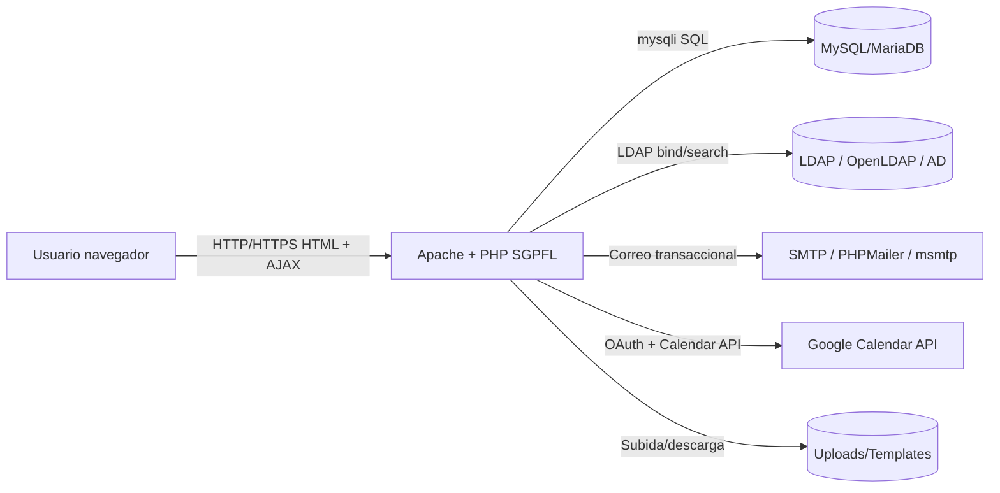
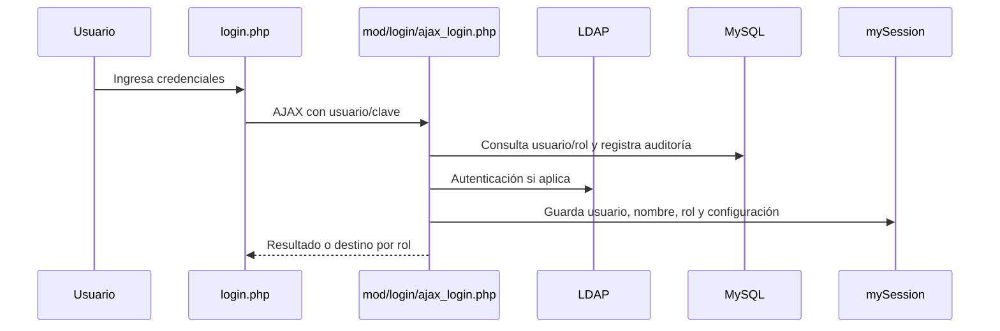
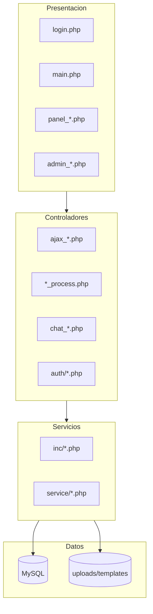
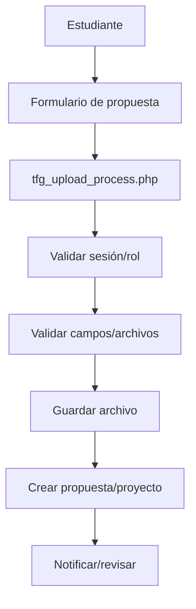
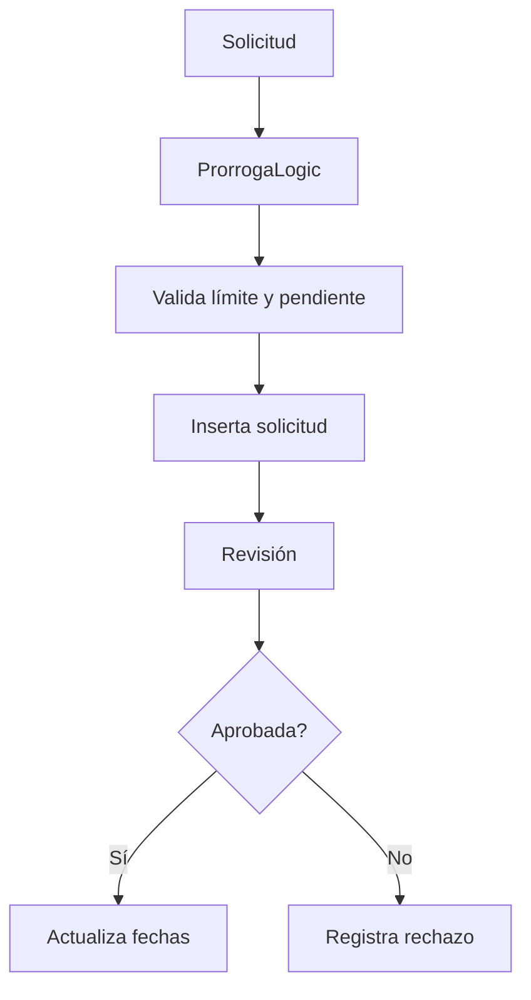

# Manual Técnico

## Sistema Gestor de Trabajos Finales de Graduación

**Sistema:** SGPFL — Sistema Gestor de Proyectos/Trabajos Finales de Graduación  
**Institución:** Universidad Nacional de Costa Rica  
**Unidad académica:** Escuela de Informática  
**Tipo de documento:** Manual técnico académico/profesional  
**Versión del documento:** 1.0  
**Fecha:** 2026-05-06  
**Repositorio base:** `/workspace/SGPFL`  
**Carpeta principal del sistema:** `base/`

---

## Control de cambios

| Versión | Fecha | Descripción | Fuente |
|---|---|---|---|
| 1.0 | 2026-05-06 | Consolidación formal de exploración, arquitectura real y módulos funcionales. | `MAPA_INICIAL_REPOSITORIO_SGPFL.md`, `ARQUITECTURA_REAL_SGPFL.md`, `MODULOS_FUNCIONALES_SGPFL.md` |

---

## Índice

1. Introducción
2. Objetivos
3. Alcance
4. Descripción general del sistema
5. Requisitos técnicos
6. Estructura del repositorio
7. Arquitectura del sistema
8. Flujo general de petición/respuesta
9. Instalación y configuración
10. Base de datos
11. Seguridad
12. Módulos funcionales
13. Pruebas
14. Despliegue
15. Mantenimiento y operación
16. Observabilidad
17. Riesgos técnicos y recomendaciones
18. Glosario
19. Anexos
20. Diagramas sugeridos
21. Tablas técnicas

---

# 1. Introducción

El presente documento constituye el **Manual Técnico del Sistema Gestor de Trabajos Finales de Graduación (SGPFL)** de la Escuela de Informática de la Universidad Nacional de Costa Rica. Su propósito es consolidar, en un formato formal y profesional, la información técnica necesaria para comprender, mantener, desplegar y evolucionar el sistema.

Este manual se elaboró a partir de la inspección directa del repositorio local `/workspace/SGPFL`, especialmente de los documentos generados durante las etapas previas de análisis:

- `base/manuales/MAPA_INICIAL_REPOSITORIO_SGPFL.md`.
- `base/manuales/ARQUITECTURA_REAL_SGPFL.md`.
- `base/manuales/MODULOS_FUNCIONALES_SGPFL.md`.

La documentación resultante no intenta idealizar la arquitectura. En su lugar, describe el sistema como está implementado: una aplicación web PHP monolítica, server-rendered, organizada parcialmente por módulos funcionales, con persistencia MySQL/MariaDB, autenticación local/LDAP, frontend integrado en PHP, endpoints AJAX y servicios puntuales para casos específicos como Google Calendar y cancelación de proyectos.

---

# 2. Objetivos

## 2.1 Objetivo general

Documentar formalmente la estructura técnica, arquitectura, módulos, dependencias, configuración, base de datos, seguridad, pruebas, despliegue y mantenimiento del sistema SGPFL, de forma que el equipo técnico pueda comprenderlo, operarlo y evolucionarlo con menor riesgo.

## 2.2 Objetivos específicos

- Describir la estructura real del repositorio y sus carpetas principales.
- Identificar las tecnologías utilizadas en backend, frontend, base de datos, pruebas e infraestructura.
- Documentar la arquitectura real del sistema sin atribuirle patrones que no implementa de forma estricta.
- Presentar los módulos funcionales mediante fichas técnicas reutilizables.
- Consolidar requisitos técnicos e instrucciones de instalación/configuración.
- Identificar entidades principales de base de datos y su agrupación funcional.
- Documentar mecanismos de seguridad, autenticación, autorización y auditoría.
- Resumir pruebas existentes y estrategia sugerida para validación.
- Proponer lineamientos de despliegue, operación, mantenimiento y observabilidad.
- Registrar riesgos técnicos y recomendaciones de mejora incremental.

---

# 3. Alcance

Este manual cubre los componentes versionados en el repositorio SGPFL, con foco en la carpeta `base/`, donde se encuentra la aplicación principal.

## 3.1 Incluye

- Aplicación PHP principal.
- Páginas y paneles funcionales.
- Scripts AJAX/proceso.
- Configuración general del sistema.
- Integración con MySQL/MariaDB.
- Integración con LDAP.
- Integración con correo/SMTP/PHPMailer/msmtp.
- Integración con Google Calendar.
- Directorios de uploads y plantillas.
- Pruebas PHPUnit y Codeception.
- Archivos Docker y guías de despliegue.
- Documentación técnica previa incluida en `base/documentation/` y `base/manuales/`.

## 3.2 No incluye

- Manual de usuario final detallado por pantalla.
- Capturas reales de interfaz, salvo que sean agregadas posteriormente.
- Auditoría de seguridad exhaustiva OWASP con explotación práctica.
- Diccionario completo de todos los campos de todas las tablas.
- Validación contra un ambiente productivo real externo al repositorio.

## 3.3 Supuestos

- El sistema se ejecuta principalmente en Apache + PHP.
- La base de datos principal es MySQL/MariaDB.
- LDAP y SMTP pueden variar entre desarrollo y producción.
- Docker se utiliza como apoyo para entornos locales o reproducibles.

---

# 4. Descripción general del sistema

SGPFL es un sistema orientado a gestionar procesos académicos relacionados con trabajos finales de graduación/proyectos finales de licenciatura. El sistema cubre funcionalidades como autenticación, gestión de usuarios, roles y permisos, presentación de paneles por rol, carga y revisión de propuestas TFG, documentos finales, prórrogas, notificaciones, mensajería interna, plantillas oficiales, actas/minutas, reportes, archivo histórico, asesores externos, integración con Google Calendar y correo transaccional.

## 4.1 Usuarios y roles principales

| Rol | Descripción funcional aproximada |
|---|---|
| Administrador | Gestiona parámetros, usuarios, roles, módulos, auditoría y permisos. |
| Gestor académico / Subdirección | Administra procesos académicos, plantillas, reportes, prórrogas y seguimiento. |
| CTFG / Comité | Revisa propuestas, documentos, minutas y procesos asociados al comité. |
| Estudiante | Registra propuestas, consulta estado, sube documentos y solicita prórrogas. |
| Asesor | Revisa documentos, participa en seguimiento y puede estar vinculado a estudiantes/proyectos. |
| Asesor externo | Perfil especial con revisión, vinculación y recuperación de contraseña diferenciada. |

Los nombres exactos de roles deben validarse contra la configuración institucional y los datos reales de `sis_rolls`.

---

# 5. Requisitos técnicos

## 5.1 Requisitos de servidor

| Componente | Versión/condición sugerida | Observación |
|---|---|---|
| Sistema operativo | Linux Ubuntu 20.04+ / Debian 11+ o equivalente | El repositorio también contiene referencias a XAMPP/Windows para desarrollo. |
| Servidor web | Apache 2.4+ | `.htaccess` usa directivas de Apache y rewrite. |
| PHP | 7.4+; plataforma Composer configurada como 8.2.12 | Revisar compatibilidad si se usa PHP 8.4. |
| Base de datos | MySQL 5.7+ / MySQL 8.0 / MariaDB 10.3+ | Docker usa MySQL 8.0. |
| LDAP | LDAPv3 / OpenLDAP / Active Directory | Requerido para autenticación/sincronización si está habilitado. |
| SMTP | Servidor institucional, Gmail, Outlook o msmtp/postfix | Requerido para correo. |
| Composer | Recomendado | Gestiona dependencias PHP. |
| Docker Compose | Opcional | Facilita app + MySQL; LDAP tiene compose separado. |

## 5.2 Extensiones PHP sugeridas

- `mysqli`.
- `ldap`.
- `zip`.
- `mbstring`.
- `fileinfo`.
- `openssl`.
- `json`.

## 5.3 Dependencias Composer principales

| Dependencia | Uso |
|---|---|
| `phpmailer/phpmailer` | Envío de correos. |
| `google/apiclient` | Integración con Google Calendar. |
| `php-webdriver/webdriver` | Automatización/pruebas funcionales. |
| `phpunit/phpunit` | Pruebas unitarias e integración. |
| `codeception/codeception` | Pruebas funcionales. |
| `php-mock/php-mock-phpunit` | Mocking de funciones PHP en pruebas. |

---

# 6. Estructura del repositorio

La aplicación principal vive dentro de `base/`. El repositorio también contiene documentación raíz y plan de despliegue.

## 6.1 Carpetas y archivos principales

| Ruta | Descripción |
|---|---|
| `README.md` | Documentación general inicial. |
| `PLAN_DEPLOYMENT.md` | Plan de despliegue Linux. |
| `base/` | Aplicación principal. |
| `base/config.inc` | Configuración de rutas, LDAP, módulos/acciones, Google Calendar, correo y deadlines. |
| `base/inc/db/bdcommon.inc` | Configuración de conexión MySQL por variables de entorno. |
| `base/inc/db/db.php` | Funciones globales de acceso a datos. |
| `base/inc/` | Funciones compartidas por dominio. |
| `base/mod/` | Módulos legacy internos de login/admin/usuarios. |
| `base/service/` | Servicios orientados a objetos puntuales. |
| `base/auth/` | Integración OAuth Google Calendar. |
| `base/base.sql` | Esquema y datos base. |
| `base/sql/` | Scripts SQL complementarios. |
| `base/docker/` | Docker app + MySQL. |
| `base/ldap-docker/` | Docker LDAP de desarrollo. |
| `base/tests/` | Pruebas unitarias, integración y funcionales. |
| `base/documentation/` | Documentación técnica por tema. |
| `base/manuales/` | Manuales y documentos formales. |
| `base/uploads/` | Archivos cargados por usuarios. |
| `base/templates/` | Plantillas y temporales DOCX. |
| `base/lib/` | Librerías frontend/PHP legacy. |
| `base/vendor/` | Dependencias Composer instaladas. |

---

# 7. Arquitectura del sistema

## 7.1 Diagnóstico arquitectónico

SGPFL no implementa de forma dominante MVC, REST API ni Clean Architecture. La descripción correcta es:

> **Monolito web PHP server-rendered, modular por páginas y carpetas funcionales, con arquitectura por capas parcial y servicios puntuales.**

## 7.2 Estilos detectados

| Estilo | Estado | Comentario |
|---|---|---|
| MVC | Parcial/no dominante | Hay vistas PHP y controladores implícitos, pero no separación estricta. |
| REST API | No dominante | Existen endpoints AJAX/JSON, pero no API REST versionada. |
| Arquitectura por capas | Parcial | Presentación, scripts controladores, funciones compartidas, servicios, BD. |
| Clean Architecture | Puntual | Cancelaciones se aproxima con service/validator/interface. |
| Monolito modular | Sí | Una aplicación PHP con módulos funcionales dentro del mismo despliegue. |
| Separación frontend/backend | No estricta | Frontend y backend coexisten en PHP server-rendered. |

## 7.3 Componentes lógicos

| Componente | Rutas | Responsabilidad |
|---|---|---|
| Presentación | `login.php`, `main.php`, `panel_*.php`, `admin_*.php` | Render HTML y formularios. |
| Navegación cliente | `inc/js/*.js` | AJAX, validaciones UI, carga dinámica. |
| Controladores HTTP | `*_process.php`, `ajax_*.php`, `chat_*.php`, `auth/*.php` | Recibir petición, validar, orquestar y responder. |
| Seguridad | `mod/login/check.php`, `functions.php`, `config.inc`, `lib/mysession` | Sesión, roles y permisos. |
| Funciones compartidas | `inc/*.php` | Reglas/utilidades por dominio. |
| Servicios OO | `service/*` | Integraciones/casos de uso encapsulados. |
| Persistencia | `inc/db/*`, `base.sql`, `mysqli` | Conexión, consultas y esquema. |
| Infraestructura | `docker/`, `.htaccess`, `ldap-docker/` | Runtime y despliegue. |

## 7.4 Diagrama de contexto sugerido



---

# 8. Flujo general de petición/respuesta

## 8.1 Flujo autenticado típico

1. El usuario abre una URL o acciona una opción del menú.
2. La petición llega a una página PHP o script de proceso.
3. El archivo incluye `mod/login/check.php` cuando está protegido.
4. `check.php` valida la sesión usando `mySession`.
5. El módulo consulta permisos o rol si corresponde.
6. El controlador/página consulta MySQL mediante `mysqli`, funciones `inc/db/db.php`, funciones de dominio o servicios.
7. La respuesta puede ser HTML, JSON, redirección o descarga de archivo.

## 8.2 Flujo de login



---

# 9. Instalación y configuración

## 9.1 Instalación general

1. Preparar servidor web Apache/PHP.
2. Instalar extensiones PHP requeridas.
3. Crear base de datos MySQL/MariaDB.
4. Importar `base/base.sql` y scripts incrementales necesarios.
5. Configurar variables de entorno o archivos de configuración.
6. Configurar LDAP si aplica.
7. Configurar SMTP/msmtp/PHPMailer.
8. Asignar permisos a `uploads/`, temporales y directorios de logs.
9. Validar acceso a `login.php`.
10. Ejecutar pruebas aplicables.

## 9.2 Variables y configuración clave

| Variable/configuración | Archivo | Uso |
|---|---|---|
| `DB_HOST` | `inc/db/bdcommon.inc` | Host MySQL. |
| `DB_USER` | `inc/db/bdcommon.inc` | Usuario MySQL. |
| `DB_PASS` | `inc/db/bdcommon.inc` | Contraseña MySQL. |
| `DB_NAME` | `inc/db/bdcommon.inc` | Base de datos. |
| `LDAP_ENABLED` | `config.inc` | Habilitar LDAP. |
| `LDAP_HOST` | `config.inc` | Host LDAP. |
| `LDAP_DN` | `config.inc` | Base DN. |
| `GOOGLE_CLIENT_ID` | `config.inc` | OAuth Google. |
| `GOOGLE_CLIENT_SECRET` | `config.inc` | OAuth Google. |
| `GOOGLE_REDIRECT_URI` | `config.inc` | Callback Google. |
| `GOOGLE_TOKEN_CIPHER_KEY` | `config.inc` | Cifrado de tokens. |

## 9.3 Permisos de archivos

| Ruta | Permiso recomendado | Motivo |
|---|---|---|
| `base/uploads/` | Escritura por usuario web | Archivos cargados por usuarios. |
| `base/templates/temp_*` | Escritura temporal | Procesamiento DOCX. |
| Logs del servidor | Escritura por runtime | Auditoría/errores. |
| Código fuente | Lectura por servidor web | Ejecución PHP. |

---

# 10. Base de datos

## 10.1 Archivos SQL

| Archivo | Propósito |
|---|---|
| `base/base.sql` | Esquema principal y datos base. |
| `base/base_add_password_recovery_table.sql` | Tabla de recuperación de contraseña. |
| `base/sql/hu029_messaging_system.sql` | Script complementario de chat/mensajería. |
| `base/ldap-docker/bootstrap/*.ldif` | Datos iniciales LDAP local. |

## 10.2 Grupos de tablas

| Grupo | Tablas principales |
|---|---|
| Seguridad y permisos | `sis_login`, `sis_user`, `sis_rolls`, `sis_mod`, `sis_mod_actions`, `sis_permits`, `sis_sessions`, `sis_sessions_vars`, `sis_log`. |
| Parámetros/catálogos | `sis_parametros_varios`, `sis_tipo_tel`, `categorias`, `comite`, `project_types`. |
| Propuestas/proyectos | `tfg_proposals`, `registered_projects`, `project_members`, `project_history`, `proyecto_aprobado`, `proyecto_aprobado_estudiantes`. |
| Documentos TFG | `tfg_files`, `tfg_final_documents`, `tfg_document_reviews`, `tfg_project_timeline`, `tfg_proposal_history`, `proyecto_notas`. |
| Prórrogas | `tfg_extension_requests`, `deadline_alerts_sent`, `auditoria_cambios_fecha`. |
| Cancelación/defensa | `acuerdo_cancelacion`, `acuerdo_defensa_publica`. |
| Notificaciones | `user_alerts`, `tfg_notifications`. |
| Archivo histórico | `tfg_proposals_archive`, `registered_projects_archive`, `project_members_archive`, `tfg_files_archive`, `archive_audit_log`. |
| Asesores externos | `external_advisor_profile_requests`, `external_advisor_linked_students`. |
| Chat | `chat_conversations`, `chat_participants`, `chat_messages`. |
| Plantillas/minutas | `plantillas_oficiales`, `project_minutes`, `project_minute_attendees`. |
| Google Calendar | `google_calendar_tokens`, `google_calendar_sync_log`. |

## 10.3 Consideraciones

- El acceso a BD combina funciones globales, `mysqli` directo y prepared statements.
- Existen funciones seguras como `seleccion_segura()` y `ejecutar_query()`.
- También existen consultas concatenadas en algunos módulos; se recomienda migrarlas gradualmente.
- Se debe implementar un mecanismo formal de migraciones para evitar diferencias entre entornos.

---

# 11. Seguridad

## 11.1 Autenticación

El sistema utiliza login local y soporte LDAP. El proceso principal está en `mod/login/ajax_login.php`, con validación de credenciales, auditoría de acceso, conteo de intentos fallidos y creación de sesión `mySession`.

## 11.2 Autorización

La autorización se basa en roles, módulos y acciones. La función `check_permiso($mod, $act, $rol)` consulta permisos y se usa especialmente en `menu.php` y módulos administrativos.

## 11.3 Sesiones

Las sesiones se gestionan con la librería `lib/mysession/` y tablas `sis_sessions` / `sis_sessions_vars`. Las páginas protegidas suelen incluir `mod/login/check.php`.

## 11.4 Auditoría

La tabla `sis_log` registra eventos de acceso, resultados de login, IP, dispositivo y detalles. También existen alertas de seguridad por múltiples intentos fallidos.

## 11.5 Seguridad de archivos

Los módulos de upload validan extensión, MIME, tamaño y directorio destino. La gestión de archivos es crítica porque el sistema maneja documentos académicos sensibles.

## 11.6 Riesgos identificados

| Riesgo | Impacto | Acción recomendada |
|---|---|---|
| CORS abierto en login | Mayor superficie de ataque | Restringir origen o eliminar si no es necesario. |
| SQL concatenado | SQL injection | Prepared statements obligatorios. |
| Validación de permisos dispersa | Endpoints sin autorización | Crear helpers `require_auth`, `require_role`, `require_permiso`. |
| Datos personales en seeds SQL | Privacidad | Anonimizar datos de desarrollo. |
| Credenciales de desarrollo en Docker | Confusión producción/desarrollo | Documentar y reemplazar por secretos en producción. |

---

# 12. Módulos funcionales

## 12.1 Resumen de módulos

| # | Módulo | Propósito |
|---:|---|---|
| 1 | Acceso, autenticación y sesión | Login, LDAP, sesión y auditoría. |
| 2 | Roles y permisos | Administración de módulos, acciones y permisos. |
| 3 | Usuarios y perfil | CRUD de usuarios y gestión de perfil. |
| 4 | Propuestas TFG | Carga, registro y seguimiento de propuestas. |
| 5 | Documentos finales | Carga, revisión, correcciones y estados. |
| 6 | Paneles por rol | Vistas de trabajo para estudiante, asesor, gestor y CTFG. |
| 7 | Prórrogas | Solicitud, revisión, aprobación y reportes. |
| 8 | Plantillas oficiales | Gestión de documentos base. |
| 9 | Actas/minutas/acuerdos | Documentación formal del comité/proyectos. |
| 10 | Notificaciones | Alertas internas y deadlines. |
| 11 | Chat | Mensajería individual y grupal. |
| 12 | Archivo histórico | Archivado de proyectos/documentos. |
| 13 | Asesores externos | Solicitudes y vinculación de asesores. |
| 14 | Google Calendar | Integración OAuth y eventos. |
| 15 | Reportes | Resúmenes y PDF académicos. |
| 16 | Cancelaciones | Cancelación bajo reglas de negocio. |
| 17 | Correo | Correo transaccional. |

## 12.2 Matriz de módulos y entidades

| Módulo | Entidades principales |
|---|---|
| Acceso | `sis_login`, `sis_user`, `sis_log`, `sis_sessions`. |
| Roles/permisos | `sis_rolls`, `sis_mod`, `sis_mod_actions`, `sis_permits`. |
| Propuestas TFG | `tfg_proposals`, `registered_projects`, `project_members`, `project_types`. |
| Documentos finales | `tfg_final_documents`, `tfg_document_reviews`, `tfg_files`. |
| Prórrogas | `tfg_extension_requests`, `auditoria_cambios_fecha`. |
| Plantillas | `plantillas_oficiales`. |
| Chat | `chat_conversations`, `chat_participants`, `chat_messages`. |
| Archivo | `*_archive`, `archive_audit_log`. |
| Calendar | `google_calendar_tokens`, `google_calendar_sync_log`. |
| Cancelación | `acuerdo_cancelacion`, `proyecto_aprobado`, `tfg_proposals`. |

## 12.3 Ejemplo de ficha resumida: Propuestas TFG

| Campo | Detalle |
|---|---|
| Archivos | `panel_subir_propuesta_tfg.php`, `tfg_upload.php`, `tfg_upload_process.php`, `inc/upload_helpers.php`, `inc/constants.php`. |
| Responsabilidades | Validar rol estudiante, bloquear estados activos, validar campos y archivos, crear propuesta/proyecto/miembros. |
| Validaciones | Sesión, rol, método POST, campos requeridos, PDF/DOCX, tamaño, estados bloqueantes. |
| Errores | JSON `success/message`, errores de conexión, propuesta bloqueante, archivo inválido, transacción fallida. |
| Observación | Extraer gradualmente a `CrearPropuestaTfgService`. |

---

# 13. Pruebas

## 13.1 Herramientas

| Herramienta | Uso |
|---|---|
| PHPUnit | Pruebas unitarias e integración. |
| Codeception | Pruebas funcionales. |
| php-mock-phpunit | Mock de funciones PHP. |
| php-webdriver | Automatización navegador. |

## 13.2 Suites detectadas

| Tipo | Ruta/configuración |
|---|---|
| Unitarias | `base/tests/unit/`, `base/phpunit.unit.xml`. |
| Integración | `base/tests/integration/`, `base/phpunit.integration.xml`. |
| Funcionales | `base/tests/functional/`, `base/codeception.yml`. |
| Datos de prueba | `base/tests/_data/`. |
| Evidencias | `base/tests/_output/`. |

## 13.3 Comandos disponibles

```bash
cd base
composer test
composer test:unit
composer test:integration
composer test:functional
composer test:functional:debug
```

## 13.4 Recomendación de pruebas por módulo

| Módulo | Pruebas prioritarias |
|---|---|
| Login | Credenciales válidas/inválidas, LDAP, auditoría, intentos fallidos. |
| Propuestas | Upload válido, MIME inválido, tamaño excesivo, estado bloqueante. |
| Documentos finales | Carga PDF, revisión, corrección, notificaciones. |
| Prórrogas | Límite de 2, pendiente duplicada, aprobación/rechazo. |
| Chat | Participantes, envío, lectura, no autorizado. |
| Plantillas | Roles, MIME, descarga activa/inactiva. |
| Cancelación | Validaciones de seis meses, duplicado, rollback. |

---

# 14. Despliegue

## 14.1 Despliegue manual recomendado

1. Preparar servidor Linux.
2. Instalar Apache, PHP y extensiones.
3. Crear base de datos y usuario dedicado.
4. Importar esquema SQL.
5. Configurar variables de entorno o archivos seguros.
6. Configurar virtual host y `AllowOverride` para `.htaccess`.
7. Configurar HTTPS.
8. Configurar LDAP y SMTP.
9. Asignar permisos a uploads/templates/logs.
10. Probar login, carga de archivos, envío de correo y conexión BD.

## 14.2 Despliegue Docker

El repositorio contiene `base/docker/docker-compose.yml` para app + MySQL. También existe `base/ldap-docker/docker-compose.yml` para LDAP local.

## 14.3 Checklist preproducción

- [ ] Credenciales productivas fuera del repositorio.
- [ ] HTTPS obligatorio.
- [ ] LDAP validado.
- [ ] SMTP validado.
- [ ] Base de datos importada y respaldada.
- [ ] `uploads/` con permisos mínimos necesarios.
- [ ] `display_errors=Off`.
- [ ] Logs habilitados.
- [ ] Pruebas críticas ejecutadas.
- [ ] Usuarios/roles iniciales verificados.

---

# 15. Mantenimiento y operación

## 15.1 Backups

| Elemento | Frecuencia sugerida | Observación |
|---|---|---|
| Base de datos | Diario o según criticidad | Respaldar antes de migraciones. |
| `uploads/` | Diario/semanal | Contiene documentos académicos. |
| Configuración | Antes de cambios | No incluir secretos en repositorio. |
| Logs | Rotación periódica | Evitar crecimiento indefinido. |

## 15.2 Actualización de dependencias

- Revisar `composer.json` y `composer.lock`.
- Ejecutar pruebas después de actualizar.
- Verificar compatibilidad con PHP real del servidor.
- Revisar vulnerabilidades conocidas.

## 15.3 Limpieza operativa

- Revisar temporales de `templates/temp_*`.
- Limpiar outputs de pruebas si contienen datos sensibles.
- Rotar logs de cron y servidor.
- Revisar crecimiento de BLOBs y uso del archivo histórico.

---

# 16. Observabilidad

## 16.1 Fuentes de observabilidad existentes

| Fuente | Uso |
|---|---|
| `sis_log` | Auditoría de acceso y eventos. |
| `user_alerts` | Alertas internas. |
| `cron_check_deadlines.log` | Job de vencimientos. |
| `error_log` PHP | Fallos de aplicación e integraciones. |
| `google_calendar_sync_log` | Sincronizaciones Calendar. |
| Logs Apache/MySQL | Diagnóstico de infraestructura. |

## 16.2 Métricas recomendadas

- Intentos fallidos de login por ventana de tiempo.
- Tiempo promedio de carga de paneles.
- Cantidad de documentos subidos por día.
- Errores de upload por tipo.
- Correos enviados/fallidos.
- Alertas pendientes/no leídas.
- Fallos de sincronización Google Calendar.
- Uso de almacenamiento en `uploads/` y BLOBs.

---

# 17. Riesgos técnicos y recomendaciones

| Riesgo | Impacto | Recomendación |
|---|---|---|
| Arquitectura híbrida/legacy | Dificulta mantenimiento | Modernizar incrementalmente, sin reescritura total. |
| SQL concatenado | Vulnerabilidad crítica | Migrar a prepared statements. |
| Control de acceso disperso | Riesgo de endpoints expuestos | Centralizar helpers de autorización. |
| Respuestas heterogéneas | Dificulta frontend/pruebas | Contrato JSON estándar para AJAX. |
| Migraciones no formales | Drift de BD | Crear migraciones versionadas. |
| Datos sensibles | Riesgo privacidad | Minimizar, anonimizar y proteger descargas/uploads. |
| Dependencias embebidas | Auditoría compleja | Definir política de dependencias y actualización. |

## 17.1 Arquitectura objetivo incremental

```text
Página/Formulario PHP
  -> Script controlador pequeño
    -> Validador explícito
      -> Servicio de aplicación
        -> Repositorio/función segura con prepared statements
          -> MySQL
```

---

# 18. Glosario

| Término | Definición |
|---|---|
| SGPFL | Sistema Gestor de Proyectos/Trabajos Finales de Graduación. |
| TFG | Trabajo Final de Graduación. |
| CTFG | Comisión de Trabajos Finales de Graduación. |
| LDAP | Protocolo de directorio usado para autenticación/sincronización. |
| SMTP | Protocolo de envío de correo electrónico. |
| OAuth | Protocolo de autorización usado para Google Calendar. |
| CRUD | Crear, leer, actualizar y eliminar registros. |
| BLOB | Dato binario almacenado en base de datos. |
| Endpoint AJAX | Script HTTP invocado desde JavaScript. |
| Prepared statement | Consulta SQL parametrizada para reducir inyección SQL. |
| Monolito modular | Aplicación única organizada por módulos internos. |
| Migración | Cambio versionado del esquema de base de datos. |

---

# 19. Anexos

## Anexo A. Documentos fuente internos

| Documento | Uso |
|---|---|
| `MAPA_INICIAL_REPOSITORIO_SGPFL.md` | Mapa del repositorio, tecnologías, carpetas, riesgos iniciales. |
| `ARQUITECTURA_REAL_SGPFL.md` | Diagnóstico arquitectónico, diagramas y flujos. |
| `MODULOS_FUNCIONALES_SGPFL.md` | Fichas por módulo funcional. |
| `README.md` | Instalación/configuración general. |
| `PLAN_DEPLOYMENT.md` | Plan de despliegue Linux. |
| `base/documentation/*.md` | Documentación técnica por tema. |
| `base/manuales/*.md` | Manuales complementarios. |

## Anexo B. Archivos críticos

| Archivo | Motivo |
|---|---|
| `base/config.inc` | Configuración global. |
| `base/inc/db/bdcommon.inc` | Conexión BD. |
| `base/inc/db/db.php` | Funciones BD. |
| `base/base.sql` | Esquema principal. |
| `base/composer.json` | Dependencias. |
| `base/.htaccess` | Límites y HTTPS. |
| `base/docker/docker-compose.yml` | Entorno Docker app/BD. |

## Anexo C. Comandos útiles

```bash
# Revisar estado del repositorio
git status --short --branch

# Instalar dependencias Composer
cd base && composer install

# Ejecutar pruebas unitarias
cd base && composer test:unit

# Ejecutar pruebas de integración
cd base && composer test:integration

# Ejecutar pruebas funcionales
cd base && composer test:functional

# Levantar Docker app + DB
cd base/docker && docker compose up -d
```

---

# 20. Diagramas sugeridos

Los diagramas se mantienen en formato Mermaid para que puedan renderizarse en plataformas compatibles o convertirse a imágenes para una versión final diagramada.

## 20.1 Diagrama de componentes



## 20.2 Flujo de propuesta TFG



## 20.3 Flujo de prórroga



---

# 21. Tablas técnicas

## 21.1 Tabla de módulos y pruebas sugeridas

| Módulo | Prueba mínima recomendada |
|---|---|
| Acceso | Login exitoso/fallido y auditoría. |
| Roles | Permiso permitido/denegado. |
| Usuarios | Alta, edición y búsqueda. |
| Propuestas | Upload válido/ inválido. |
| Documentos finales | Revisión y corrección. |
| Prórrogas | Límite, pendiente y aprobación. |
| Plantillas | Subida, descarga y permisos. |
| Chat | Envío, lectura y autorización. |
| Archivo | Archivado con rollback ante error. |
| Calendar | OAuth callback y cifrado de token. |
| Cancelación | Regla de seis meses y duplicados. |

## 21.2 Checklist de calidad para cambios futuros

- [ ] Validación explícita de sesión.
- [ ] Validación de rol/permiso.
- [ ] Prepared statements en toda entrada externa.
- [ ] Respuesta JSON uniforme en endpoints AJAX.
- [ ] Logs sin datos sensibles.
- [ ] Pruebas para reglas de negocio.
- [ ] Migración SQL si cambia esquema.
- [ ] Documentación actualizada del módulo afectado.

---

# 22. Cierre

Este manual consolida la base técnica formal del sistema SGPFL y está diseñado para crecer de forma ordenada. Las siguientes versiones deberían incorporar capturas de pantalla, diagramas renderizados, diccionario completo de base de datos, trazabilidad exacta de permisos por endpoint, resultados de pruebas ejecutadas y validación contra un ambiente real de producción o preproducción.
