# Capítulo de módulos funcionales del sistema SGPFL

**Sistema:** SGPFL — Sistema Gestor de Proyectos Finales de Licenciatura  
**Etapa del manual:** Prompt 3 de 5 — Documentación por módulos funcionales  
**Fecha de levantamiento:** 2026-05-06  
**Fuente:** inspección directa del repositorio local `/workspace/SGPFL`

---

## 1. Diagnóstico breve

El sistema está compuesto por módulos funcionales implementados principalmente como páginas PHP, scripts de proceso/AJAX, funciones compartidas en `inc/`, servicios puntuales en `service/` y tablas MySQL definidas en `base.sql`. La modularidad existe, pero no es homogénea: algunos módulos están bien concentrados (`chat`, `plantillas`, `cancelaciones`, `Google Calendar`), mientras que otros mezclan vista, controlador, validaciones, SQL y reglas de negocio en el mismo archivo.

La documentación por módulos debe evitar afirmar que todos los módulos siguen la misma arquitectura. La forma correcta de describirlos es por **fichas funcionales**, indicando evidencias concretas, rutas, entidades relacionadas, dependencias internas y observaciones técnicas.

---

## 2. Criterio de clasificación de módulos

Para este capítulo, un módulo funcional es un conjunto de archivos que implementa una capacidad observable del sistema. Cada ficha incluye:

| Campo | Descripción |
|---|---|
| Nombre del módulo | Nombre funcional entendible por negocio y equipo técnico. |
| Propósito | Qué problema resuelve dentro del SGPFL. |
| Archivos principales | Páginas, scripts, helpers, servicios y pruebas relacionadas. |
| Responsabilidades | Operaciones cubiertas por el módulo. |
| Rutas/endpoints | Archivos HTTP invocables directamente o vía AJAX/formularios. |
| Servicios involucrados | Clases/funciones reutilizables que encapsulan lógica. |
| Entidades/modelos | Tablas MySQL o estructuras persistentes asociadas. |
| Flujo funcional | Secuencia general de ejecución. |
| Validaciones | Controles de entrada, sesión, rol, archivos o negocio. |
| Errores manejados | Fallos previstos y respuesta observada. |
| Dependencias internas | Includes, helpers, config, librerías o módulos relacionados. |
| Observaciones técnicas | Riesgos, deuda técnica y mejoras recomendadas. |

---

## 3. Mapa resumido de módulos

| # | Módulo | Tipo dominante | Archivos/evidencia principal | Estado técnico |
|---:|---|---|---|---|
| 1 | Acceso, autenticación y sesión | Login + sesión + auditoría | `login.php`, `mod/login/`, `lib/mysession/`, `inc/db/db.php` | Crítico; mezcla LDAP, BD, sesión y auditoría. |
| 2 | Roles, permisos y administración base | Administración legacy | `admin_modulos.php`, `admin_roles.php`, `mod/admin/permits/`, `mod/admin/rolls/` | Central para autorización; SQL procedural. |
| 3 | Gestión de usuarios y perfil | CRUD/admin + perfil | `admin_usuarios.php`, `mod/admin/users/ajax_*`, `edit_perfil.php` | Amplio; ligado a roles y permisos. |
| 4 | Propuestas TFG | Flujo académico + upload | `panel_subir_propuesta_tfg.php`, `tfg_upload.php`, `tfg_upload_process.php`, `inc/upload_helpers.php` | Módulo crítico; validaciones de archivos y estados. |
| 5 | Documentos finales y revisión TFG | Workflow documental | `panel_revision_tfg.php`, `panel_ctfg_review_final_documents.php`, `tfg_final_*`, `process_final_document_review.php` | Crítico; múltiples roles y estados. |
| 6 | Paneles por rol | Vistas de resumen | `panel_estudiante.php`, `panel_asesor.php`, `panel_gestor.php`, `panel_ctfg.php`, `Panel*Logic.php` | Heterogéneo; algunas consultas apuntan a tablas no confirmadas. |
| 7 | Prórrogas | Solicitud/aprobación/reporte | `panel_solicitudProrroga.php`, `panel_aprobarProrroga.php`, `ProrrogaLogic.php`, `prorroga_report_*` | Reglas de negocio importantes; incluye alter dinámico de esquema. |
| 8 | Plantillas oficiales | Gestión de documentos base | `panel_plantillas.php`, `plantilla_*`, `inc/plantillas_functions.php` | Bien delimitado; valida MIME/tamaño/roles. |
| 9 | Actas, minutas y acuerdos | Gestión documental formal | `generar_acta.php`, `procesar_acta.php`, `panel_committee_minutes.php`, `minute_*` | Generación/descarga; usa FPDF/DOCX. |
| 10 | Notificaciones y alertas | Alertas internas + deadlines | `inc/alert_functions.php`, `historial_alertas.php`, `cron_check_deadlines.php`, `inc/deadline_functions.php` | Transversal; soporta varios flujos. |
| 11 | Chat/mensajería interna | AJAX + funciones de negocio | `chat.php`, `chat_*.php`, `inc/chat_functions.php`, `inc/js/chat.js` | Módulo relativamente cohesivo. |
| 12 | Archivo histórico | Archivado y consulta | `panel_archivo_historico.php`, `inc/archive_functions.php`, tablas `*_archive` | Útil para ciclo de vida documental. |
| 13 | Asesores externos | Solicitudes/perfiles/vínculos | `panel_revisar_asesor_externo.php`, `external_advisor_*`, pruebas HU011 | Integrado con alertas y documentos. |
| 14 | Google Calendar | Integración OAuth/API | `auth/`, `service/GoogleCalendarService.php`, tablas `google_calendar_*` | Servicio OO claro; depende de tokens cifrados. |
| 15 | Reportes y resúmenes | PDF/reporting | `panel_student_summary.php`, `student_summary_*`, `prorroga_report_*` | Genera salidas PDF y consultas agregadas. |
| 16 | Cancelación de proyectos | Caso de uso con servicio | `cancelar_proyecto_aprobado.php`, `service/cancelaciones/*`, `acuerdo_cancelacion` | El más cercano a servicio + validador + repositorio. |
| 17 | Correo transaccional | Envío de mensajes | `inc/email_helper.php`, `inc/email_template_helper.php`, `send_tfg_mail.php`, `test_mail*.php` | Transversal; depende de PHPMailer/SMTP. |

---

## 4. Fichas detalladas por módulo

### 4.1 Módulo: Acceso, autenticación y sesión

| Campo | Detalle |
|---|---|
| Propósito | Permitir ingreso al sistema, validar credenciales, crear sesión, redirigir según rol y registrar auditoría de acceso. |
| Archivos principales | `base/login.php`, `base/mod/login/ajax_login.php`, `base/mod/login/check.php`, `base/mod/login/logout.php`, `base/logout.php`, `base/clear_session.php`, `base/lib/mysession/`, `base/config.inc`, `base/inc/db/db.php`. |
| Rutas/endpoints | `login.php`, `mod/login/ajax_login.php`, `mod/login/logout.php`, `mod/login/cambiar_contrasena_asesor.php`, `mod/login/send_password_recovery_email.php`, `mod/login/verify_password_recovery.php`, `mod/login/reset_password_advisor.php`. |
| Servicios involucrados | `AuthLdap` en `lib/AuthLdap`, funciones de auditoría y acceso en `inc/db/db.php`, sesión `mySession`. |
| Entidades/modelos | `sis_login`, `sis_user`, `sis_rolls`, `sis_sessions`, `sis_sessions_vars`, `sis_log`, `password_recovery_tokens`. |
| Responsabilidades | Autenticar usuario local/LDAP, capturar IP/user-agent, contar intentos fallidos, registrar auditoría, crear variables de sesión, destruir sesión, recuperar contraseña para asesor externo. |
| Validaciones | Método HTTP/OPTIONS en login AJAX; existencia de sesión en `check.php`; disponibilidad de BD; conteo de intentos fallidos; usuario/rol para redirección. |
| Errores manejados | Error de conexión BD devuelve código de error en login; sesión ausente redirige a `login.php?return_to=...`; fallos de auditoría registran `error_log`. |
| Dependencias internas | `config.inc`, `inc/db/db.php`, `lang/lang.es`, `lib/mysession`, `lib/AuthLdap`. |
| Observaciones técnicas | `ajax_login.php` concentra demasiadas responsabilidades y declara CORS abierto con `Access-Control-Allow-Origin: *`; conviene restringir origen y extraer autenticación/auditoría a servicios probables. |

**Flujo funcional sugerido**

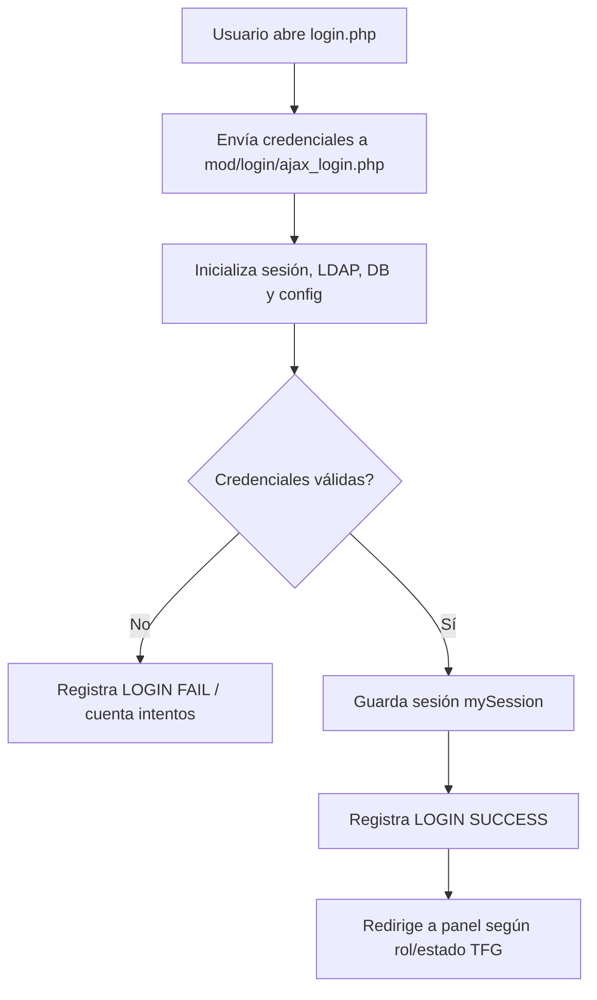

---

### 4.2 Módulo: Roles, permisos y administración base

| Campo | Detalle |
|---|---|
| Propósito | Administrar módulos, roles y permisos que determinan acceso a funcionalidades. |
| Archivos principales | `base/admin_modulos.php`, `base/admin_roles.php`, `base/mod/admin/permits/`, `base/mod/admin/rolls/`, `base/functions.php`, `base/menu.php`. |
| Rutas/endpoints | `mod/admin/permits/list_mod.php`, `new_mod.php`, `edit_mod.php`, `ajax_new_mod.php`, `ajax_upd_mod.php`, `ajax_del_mod.php`; equivalentes en `mod/admin/rolls/`. |
| Servicios involucrados | Función global `check_permiso($mod, $act, $rol)` en `functions.php`. |
| Entidades/modelos | `sis_mod`, `sis_mod_actions`, `sis_rolls`, `sis_permits`. |
| Responsabilidades | Listar/agregar/editar/eliminar módulos y roles; evaluar permisos en menú; habilitar/ocultar opciones según rol. |
| Validaciones | Verificación de sesión vía `mod/login/check.php`; permisos por módulo/acción; validación básica en scripts AJAX. |
| Errores manejados | Redirecciones con mensajes flash en páginas superiores; respuestas AJAX en scripts de módulo/rol. |
| Dependencias internas | `functions.php`, `inc/db/db.php`, `config.inc`, `menu.php`, `lang/lang.es`. |
| Observaciones técnicas | La autorización depende de llamadas manuales a `check_permiso`; existe riesgo de endpoints nuevos sin permiso explícito. Conviene crear un helper central `require_permiso($mod, $act)`. |

**Flujo funcional sugerido**

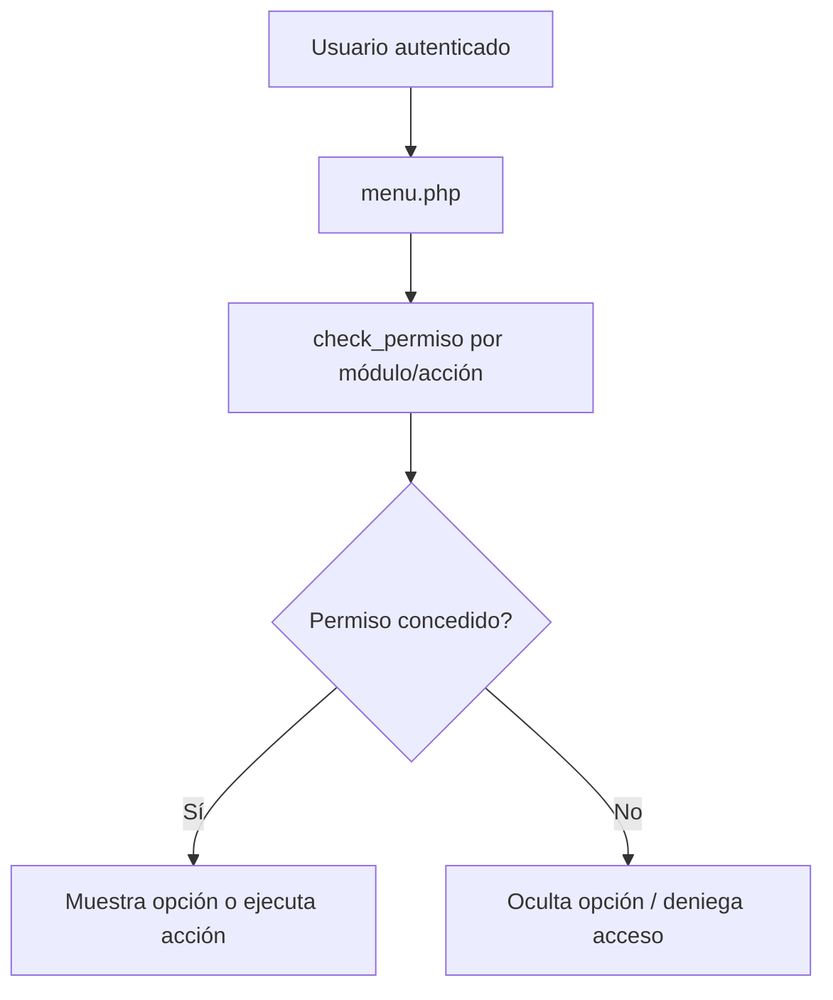

---

### 4.3 Módulo: Gestión de usuarios y perfil

| Campo | Detalle |
|---|---|
| Propósito | Mantener usuarios, perfiles y búsquedas utilizadas por administración y flujos académicos. |
| Archivos principales | `base/admin_usuarios.php`, `base/mod/admin/users/list_user.php`, `new_user.php`, `edit_user.php`, `edit_perfil.php`, `ajax_list_user.php`, `ajax_new_user.php`, `ajax_upd_user.php`, `ajax_del_user.php`, `search_users.php`, `ajax_get_name.php`. |
| Rutas/endpoints | Páginas de gestión bajo `mod/admin/users/` y scripts `ajax_*`. |
| Servicios involucrados | Funciones DB globales; consultas directas `mysqli`; `get_ldap_name()` en `functions.php` para nombre LDAP. |
| Entidades/modelos | `sis_user`, `sis_login`, `sis_rolls`, `external_advisor_linked_students` cuando aplica vínculo asesor-estudiante. |
| Responsabilidades | Alta, edición, eliminación/listado de usuarios; edición de perfil propio; búsqueda de usuarios para proyectos, chat o asignaciones. |
| Validaciones | Sesión; permisos de administración; datos requeridos; rol asociado; búsqueda por nombre/ID/email según endpoint. |
| Errores manejados | Respuestas AJAX o mensajes de pantalla; consultas fallidas pueden depender de manejo de `inc/db/db.php`. |
| Dependencias internas | `mod/login/check.php`, `functions.php`, `inc/db/db.php`, `config.inc`, `lang/lang.es`. |
| Observaciones técnicas | Es un módulo transversal que otros módulos reutilizan. Conviene aislar búsquedas de usuario en una función/repositorio común para evitar duplicación y diferencias de filtros. |

**Flujo funcional sugerido**

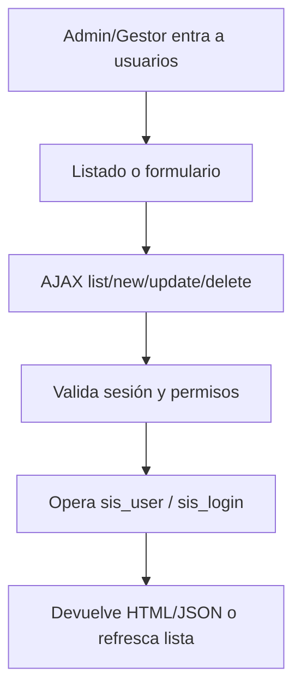

---

### 4.4 Módulo: Propuestas TFG

| Campo | Detalle |
|---|---|
| Propósito | Permitir a estudiantes registrar propuestas de TFG, subir documentos y crear la base del proyecto académico. |
| Archivos principales | `base/panel_subir_propuesta_tfg.php`, `base/mod/admin/users/tfg_upload.php`, `base/mod/admin/users/tfg_upload_process.php`, `base/mod/admin/users/tfg_status.php`, `base/inc/upload_helpers.php`, `base/inc/tfg_proposal_functions.php`, `base/inc/constants.php`. |
| Rutas/endpoints | `panel_subir_propuesta_tfg.php`, `mod/admin/users/tfg_upload.php`, `mod/admin/users/tfg_upload_process.php`, `mod/admin/users/tfg_status.php`, `mod/admin/users/tfg_download.php`, `tfg_download_file.php`. |
| Servicios involucrados | `upload_helpers.php` para validación/procesamiento de archivos; `tfg_proposal_functions.php` para límite/historial de versiones. |
| Entidades/modelos | `tfg_proposals`, `tfg_proposal_history`, `registered_projects`, `project_members`, `project_types`, `tfg_files`, `project_history`. |
| Responsabilidades | Mostrar estado de propuesta; validar rol estudiante; bloquear nuevas propuestas en estados activos; procesar PDF/DOCX; crear registros de propuesta/proyecto/miembros; mantener versiones/historial. |
| Validaciones | Sesión y rol estudiante; método POST; campos requeridos; título mínimo; descripción mínima; tipo de proyecto válido; archivo PDF/DOCX; tamaño total; estados bloqueantes `TFG_BLOCKING_STATUSES`. |
| Errores manejados | Respuestas JSON con `success/message`; errores de conexión; propuesta bloqueante; archivo inválido; ausencia de documentos; fallos de transacción. |
| Dependencias internas | `mod/login/check.php`, `inc/db/bdcommon.inc`, `inc/upload_helpers.php`, `inc/constants.php`, `inc/tfg_proposal_functions.php`. |
| Observaciones técnicas | Es uno de los módulos más críticos. Tiene validaciones importantes, pero el script de proceso es extenso; se recomienda extraer caso de uso `CrearPropuestaTfgService` y repositorio. |

**Flujo funcional sugerido**

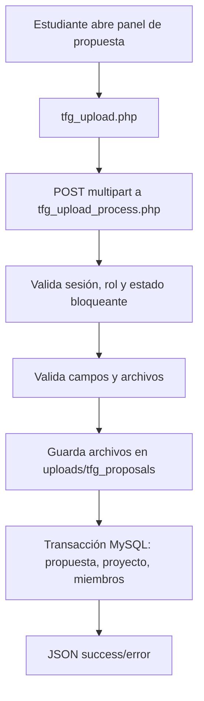

---

### 4.5 Módulo: Documentos finales y revisión TFG

| Campo | Detalle |
|---|---|
| Propósito | Gestionar carga, revisión, correcciones y estado de documentos finales de TFG. |
| Archivos principales | `base/panel_revision_tfg.php`, `base/panel_ctfg_review_final_documents.php`, `base/mod/admin/users/tfg_upload_final_document.php`, `tfg_upload_final_process.php`, `tfg_upload_correction.php`, `tfg_upload_correction_process.php`, `process_final_document_review.php`, `tfg_review_list.php`, `inc/tfg_final_functions.php`. |
| Rutas/endpoints | `panel_revision_tfg.php`, `panel_ctfg_review_final_documents.php`, `mod/admin/users/tfg_*final*`, `mod/admin/users/process_final_document_review.php`, `mod/admin/users/tfg_update_status.php`. |
| Servicios involucrados | `inc/tfg_final_functions.php`, `inc/upload_helpers.php`, `inc/alert_functions.php`, correo vía `send_tfg_mail.php`. |
| Entidades/modelos | `tfg_final_documents`, `tfg_document_reviews`, `tfg_project_timeline`, `tfg_notifications`, `tfg_files`, `user_alerts`. |
| Responsabilidades | Carga de documento final; revisión por asesor/CTFG; registro de correcciones; actualización de estado; notificación a estudiantes/roles; descarga de archivos. |
| Validaciones | Sesión/rol; archivo PDF para final; tamaño mínimo/máximo; estado del documento; comentarios de revisión cuando aplica; IDs de propuesta/documento. |
| Errores manejados | JSON o mensajes HTML; errores de subida; documento no encontrado; revisión inválida; fallos de BD/log. |
| Dependencias internas | `mod/login/check.php`, `inc/constants.php`, `inc/upload_helpers.php`, `inc/alert_functions.php`, `inc/tfg_final_functions.php`. |
| Observaciones técnicas | El módulo agrupa varios subflujos y roles. Debe documentarse con estados claros para evitar ambigüedad entre `Pendiente de Revision`, `Aprobado`, `Rechazado` y correcciones. |

**Flujo funcional sugerido**

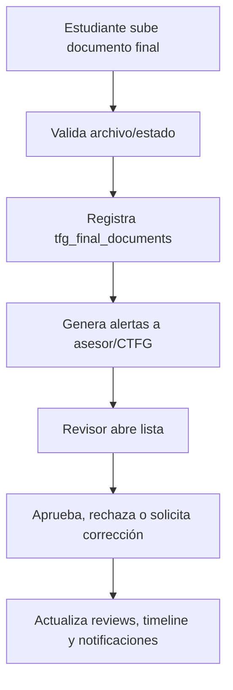

---

### 4.6 Módulo: Paneles por rol

| Campo | Detalle |
|---|---|
| Propósito | Presentar vistas de trabajo/resumen para estudiante, asesor, gestor, CTFG, subdirección y administración. |
| Archivos principales | `panel_estudiante.php`, `PanelEstudianteLogic.php`, `panel_asesor.php`, `PanelAsesorLogic.php`, `panel_gestor.php`, `PanelGestorLogic.php`, `panel_ctfg.php`, `PanelCTFGLogic.php`, `panel_subdireccion.php`, `dashboard.php`. |
| Rutas/endpoints | Páginas `panel_*.php` y navegación desde `dashboard.php`/`menu.php`. |
| Servicios involucrados | Clases `PanelEstudiante`, `PanelAsesor`, `PanelGestor`, `PanelCTFG`; funciones DB. |
| Entidades/modelos | `tfg_proposals`, `tfg_final_documents`, `tfg_document_reviews`, `tfg_notifications`, `tfg_project_timeline`; algunas clases referencian tablas no confirmadas en `base.sql` como `tfg_meetings`, `tfg_observaciones`, `tfg_commission_meetings`, `tfg_announcements`, `tfg_evaluations`. |
| Responsabilidades | Mostrar próximas fechas, tareas pendientes, documentos, revisiones, reuniones, avisos y calificaciones según rol. |
| Validaciones | Sesión; rol esperado; consultas por usuario/rol. |
| Errores manejados | Constructores lanzan excepción ante error de conexión; consultas fallidas pueden devolver arreglos vacíos o mensajes por defecto. |
| Dependencias internas | `inc/db/db.php`, `mod/login/check.php`, `lang/lang.es`, includes de layout. |
| Observaciones técnicas | Hay deuda técnica importante: varias consultas de panel apuntan a tablas que no aparecen en el esquema principal. Esto debe validarse antes de presentar esos datos como funcionalidad productiva. |

**Flujo funcional sugerido**

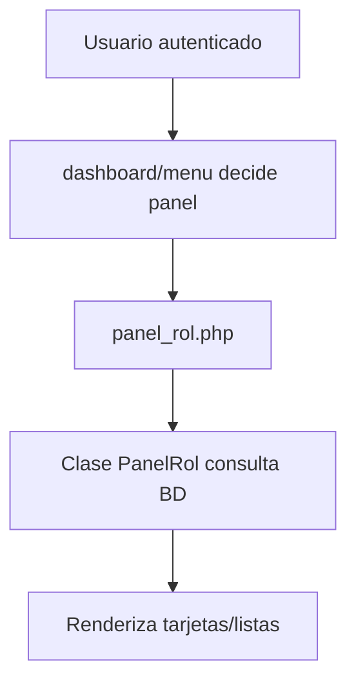

---

### 4.7 Módulo: Prórrogas

| Campo | Detalle |
|---|---|
| Propósito | Permitir solicitud, aprobación/rechazo, detalle y reporte de prórrogas de proyectos TFG. |
| Archivos principales | `panel_solicitudProrroga.php`, `panel_aprobarProrroga.php`, `detalle_prorroga.php`, `panel_reporte_prorrogas.php`, `mod/admin/users/ProrrogaLogic.php`, `procesar_prorroga.php`, `responder_prorroga.php`, `prorroga_report_queries.php`, `prorroga_report_service.php`, `prorroga_report_pdf.php`. |
| Rutas/endpoints | Paneles de solicitud/aprobación/reporte; `mod/admin/users/procesar_prorroga.php`; `mod/admin/users/responder_prorroga.php`; descarga PDF de reporte. |
| Servicios involucrados | `ProrrogaLogic`; report service/queries/PDF; FPDF para PDF. |
| Entidades/modelos | `tfg_extension_requests`, `auditoria_cambios_fecha`, `deadline_alerts_sent`, `registered_projects`, `tfg_proposals`. |
| Responsabilidades | Crear solicitud; validar máximo de prórrogas; evitar duplicadas pendientes; guardar documentos; aprobar/rechazar; recalcular fecha final; generar reportes. |
| Validaciones | Proyecto no concluido/cancelado; máximo 2 prórrogas; no tener solicitud pendiente; número de prórroga 1 o 2; archivos adjuntos; permisos del revisor. |
| Errores manejados | Retornos `success/message`; errores de preparación SQL; errores de guardado; logs en `error_log`; validaciones devuelven mensajes de negocio. |
| Dependencias internas | `inc/db/db.php`, Composer/vendor para PDF si aplica, `mod/login/check.php`, FPDF. |
| Observaciones técnicas | `ProrrogaLogic` intenta alterar esquema en runtime (`fecha_actualizada`). Esto es riesgoso en producción; conviene moverlo a migración SQL versionada. |

**Flujo funcional sugerido**

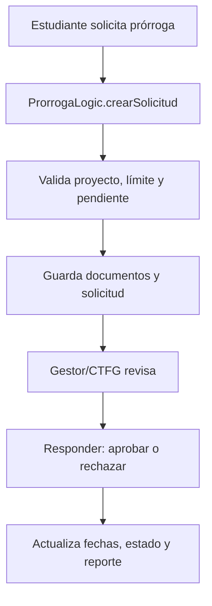

---

### 4.8 Módulo: Plantillas oficiales

| Campo | Detalle |
|---|---|
| Propósito | Administrar plantillas oficiales para propuestas, informes finales, actas u otros documentos. |
| Archivos principales | `panel_plantillas.php`, `plantilla_upload_process.php`, `plantilla_delete_process.php`, `plantilla_toggle_activo.php`, `descargar_plantilla.php`, `inc/plantillas_functions.php`. |
| Rutas/endpoints | `panel_plantillas.php`, `plantilla_upload_process.php`, `plantilla_delete_process.php`, `plantilla_toggle_activo.php`, `descargar_plantilla.php`. |
| Servicios involucrados | Funciones `getPlantillasActivas`, `getTodasLasPlantillas`, `getPlantillaParaDescarga`, `insertarPlantilla`, `eliminarPlantilla`, `toggleActivoPlantilla`. |
| Entidades/modelos | `plantillas_oficiales`, `sis_user`. |
| Responsabilidades | Listar plantillas; descargar según rol/estado; subir PDF/DOCX; validar MIME/tamaño; activar/desactivar; eliminar. |
| Validaciones | Sesión; roles permitidos admin/gestor para gestión; método POST; nombre/tipo; archivo real con `is_uploaded_file`; MIME real; extensión; tamaño máximo. |
| Errores manejados | JSON sanitizado; HTTP 401/403/405; mensajes de archivo inválido o permisos insuficientes. |
| Dependencias internas | `lib/mysession`, `inc/plantillas_functions.php`, `inc/db/bdcommon.inc`, SweetAlert2 en UI. |
| Observaciones técnicas | Es uno de los módulos mejor delimitados en endpoints/funciones. Recomendable usarlo como referencia para nuevos endpoints JSON. |

**Flujo funcional sugerido**

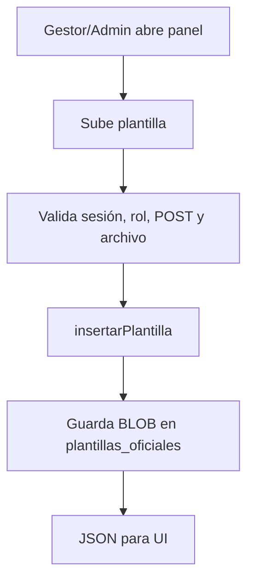

---

### 4.9 Módulo: Actas, minutas y acuerdos

| Campo | Detalle |
|---|---|
| Propósito | Generar, cargar, listar y descargar actas/minutas/acuerdos relacionados con proyectos y comité. |
| Archivos principales | `generar_acta.php`, `procesar_acta.php`, `listar_actas.php`, `PanelRegistroAcuerdo.php`, `panel_committee_minutes.php`, `mod/admin/users/minute_upload_process.php`, `minute_download.php`, `CommitteeMinute*Repository.php`, `approval_agreement_download.php`, `defense_agreement_download.php`, `tfg_upload_defense_agreement*`. |
| Rutas/endpoints | `generar_acta.php`, `procesar_acta.php`, `listar_actas.php`, `panel_committee_minutes.php`, `mod/admin/users/minute_upload_process.php`, descargas de acuerdos/minutas. |
| Servicios involucrados | Repositorios `CommitteeMinuteListRepository`, `CommitteeMinuteParticipantsRepository`, `CommitteeMinuteProjectRepository`; FPDF; procesamiento DOCX en `procesar_acta.php`. |
| Entidades/modelos | `project_minutes`, `project_minute_attendees`, `acuerdo_defensa_publica`, `proyecto_aprobado`, `proyecto_aprobado_estudiantes`. |
| Responsabilidades | Generar documentos a partir de plantillas; registrar minutas; validar duplicados por proyecto/fecha; descargar archivos con nombres legibles; gestionar asistentes/participantes. |
| Validaciones | Sesión; fecha de sesión; archivo subido; duplicado de minuta; proyecto existente; permisos del rol. |
| Errores manejados | Redirección con mensajes; errores de descarga; validación de archivo y fecha; logs. |
| Dependencias internas | `mod/login/check.php`, `inc/db/bdcommon.inc`, FPDF, templates DOCX, repositorios de minutas. |
| Observaciones técnicas | Es un módulo documental sensible; debe estandarizar naming, almacenamiento y permisos de descarga para evitar exposición de documentos académicos. |

**Flujo funcional sugerido**

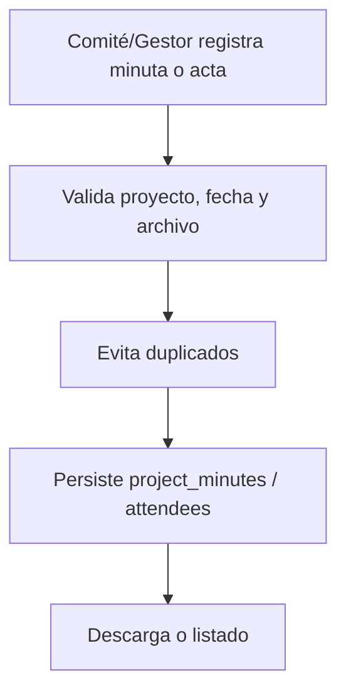

---

### 4.10 Módulo: Notificaciones y alertas

| Campo | Detalle |
|---|---|
| Propósito | Notificar eventos relevantes a usuarios y roles: propuestas, documentos finales, correcciones, prórrogas, asesores, deadlines y seguridad. |
| Archivos principales | `inc/alert_functions.php`, `inc/deadline_functions.php`, `historial_alertas.php`, `cron_check_deadlines.php`, `historial_documentos.php`, `NOTIFICACIONES_SOLUCION.md`. |
| Rutas/endpoints | `historial_alertas.php`, `cron_check_deadlines.php`, scripts que invocan alertas desde TFG/prórrogas/login. |
| Servicios involucrados | Funciones `registerAlert`, `registerAlertToRole`, `getUserAlerts`, `markAlertAsRead`, `registerProposalSubmittedAlert`, `registerFinalDocumentAlert`, `registerDeadlineAlert`, entre otras. |
| Entidades/modelos | `user_alerts`, `tfg_notifications`, `deadline_alerts_sent`, `sis_log`. |
| Responsabilidades | Registrar alertas por usuario/rol; consultar no leídas; marcar como leídas; evitar duplicados recientes; alertar por deadlines; alertar intentos fallidos de login. |
| Validaciones | Usuario destino; rol destino; duplicados recientes; límites de consulta; ventana de intentos fallidos. |
| Errores manejados | Retornos booleanos/arrays; logs en error_log; fallbacks al insertar auditoría con usuario nulo. |
| Dependencias internas | `inc/db/db.php`, `config.inc`, cron, email helper para avisos por correo cuando aplica. |
| Observaciones técnicas | Módulo transversal con muchas funciones. Conviene separar alertas de negocio, alertas de seguridad y alertas de deadline para facilitar pruebas y auditoría. |

**Flujo funcional sugerido**

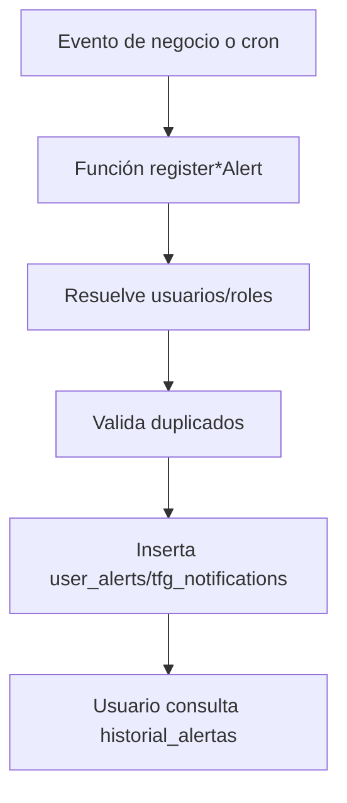

---

### 4.11 Módulo: Chat y mensajería interna

| Campo | Detalle |
|---|---|
| Propósito | Permitir comunicación interna entre usuarios, conversaciones individuales y chats grupales de proyecto. |
| Archivos principales | `chat.php`, `chat_get_conversations.php`, `chat_get_members.php`, `chat_get_messages.php`, `chat_mark_read.php`, `chat_search_users.php`, `chat_send_message.php`, `inc/chat_functions.php`, `inc/js/chat.js`, `inc/css/chat.css`. |
| Rutas/endpoints | `chat_*.php` como endpoints AJAX; `chat.php` como pantalla principal. |
| Servicios involucrados | Funciones `chatSearchUsers`, `getOrCreateIndividualConversation`, `createProjectGroupChat`, `sendMessage`, `getConversationMessages`, `getUserConversations`, `markConversationAsRead`. |
| Entidades/modelos | `chat_conversations`, `chat_participants`, `chat_messages`, `sis_user`, `sis_login`, `sis_rolls`, `proyecto_aprobado`, `project_members`. |
| Responsabilidades | Buscar usuarios; crear conversación individual; crear/sincronizar chat de proyecto; enviar mensajes; obtener conversaciones; marcar lectura; contar no leídos. |
| Validaciones | Sesión; método POST para envío; longitud mínima/máxima; participación en conversación; existencia de usuario/proyecto. |
| Errores manejados | JSON `success/error`; error de conexión; conversación no especificada; no autenticado; método no permitido; mensaje vacío o demasiado largo. |
| Dependencias internas | `mod/login/check.php`, `inc/chat_functions.php`, `inc/constants.php`, `inc/db/bdcommon.inc`. |
| Observaciones técnicas | Es un módulo cohesivo y testeado. Se recomienda revisar autorización de participación en todos los endpoints de lectura/escritura para evitar acceso lateral a conversaciones. |

**Flujo funcional sugerido**

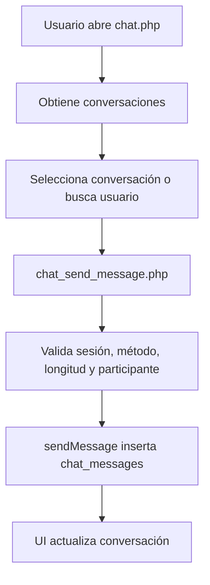

---

### 4.12 Módulo: Archivo histórico

| Campo | Detalle |
|---|---|
| Propósito | Archivar propuestas, proyectos, miembros y documentos para liberar BLOBs y mantener trazabilidad histórica. |
| Archivos principales | `panel_archivo_historico.php`, `inc/archive_functions.php`, `tests/unit/ArchiveProjectTest.php`. |
| Rutas/endpoints | `panel_archivo_historico.php`; funciones invocadas desde flujos de conclusión/cancelación. |
| Servicios involucrados | `archiveProject`, `archiveRegisteredProject`, `archiveProjectMembers`, `archiveAdditionalFiles`, helpers de compresión. |
| Entidades/modelos | `tfg_proposals_archive`, `registered_projects_archive`, `project_members_archive`, `tfg_files_archive`, `archive_audit_log`, `tfg_proposals`, `registered_projects`, `project_members`, `tfg_files`. |
| Responsabilidades | Validar motivo de archivado; comprimir documento principal; copiar datos a tablas históricas; actualizar/liberar documentos originales; registrar auditoría. |
| Validaciones | Motivo permitido (`Concluido`, `Cancelado`); propuesta existente; transacción atómica; existencia de proyecto asociado. |
| Errores manejados | Rollback de transacción; logs HU-027; retorno `success/message`. |
| Dependencias internas | `inc/db/bdcommon.inc`, `inc/archive_functions.php`, tablas de archivo, tests unitarios. |
| Observaciones técnicas | Buena práctica de ciclo de vida documental, pero debe acompañarse con políticas de retención, backup y recuperación. |

**Flujo funcional sugerido**

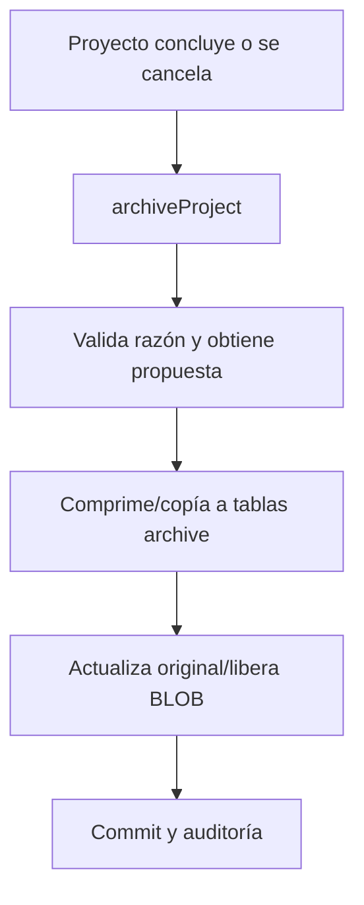

---

### 4.13 Módulo: Asesores externos

| Campo | Detalle |
|---|---|
| Propósito | Gestionar solicitudes, validación y vinculación de asesores externos con estudiantes/proyectos. |
| Archivos principales | `panel_revisar_asesor_externo.php`, `mod/login/cambiar_contrasena_asesor.php`, `mod/login/reset_password_advisor.php`, documentación `EXTERNAL_ADVISORS.md`, pruebas `ExternalAdvisorProfileHU011*`. |
| Rutas/endpoints | Panel de revisión de asesor externo; recuperación/cambio de contraseña de asesor; posibles formularios de perfil. |
| Servicios involucrados | Funciones/consultas directas; alertas de asesor externo en `inc/alert_functions.php`. |
| Entidades/modelos | `external_advisor_profile_requests`, `external_advisor_linked_students`, `sis_user`, `sis_login`, `user_alerts`. |
| Responsabilidades | Recibir/revisar datos de asesor externo; aprobar/rechazar perfil; vincular asesor con estudiante; recuperación de contraseña diferenciada. |
| Validaciones | Sesión/rol revisor; archivos PDF/identificación/CV cuando aplica; existencia de estudiante vinculado; bloqueo de reenvío según pruebas. |
| Errores manejados | Mensajes de rechazo; validaciones de archivos; estados solo lectura tras envío; alertas. |
| Dependencias internas | `mod/login`, `inc/alert_functions.php`, DB, pruebas HU011. |
| Observaciones técnicas | Involucra datos personales y documentos sensibles. Debe reforzarse trazabilidad, permisos mínimos y retención de archivos. |

**Flujo funcional sugerido**

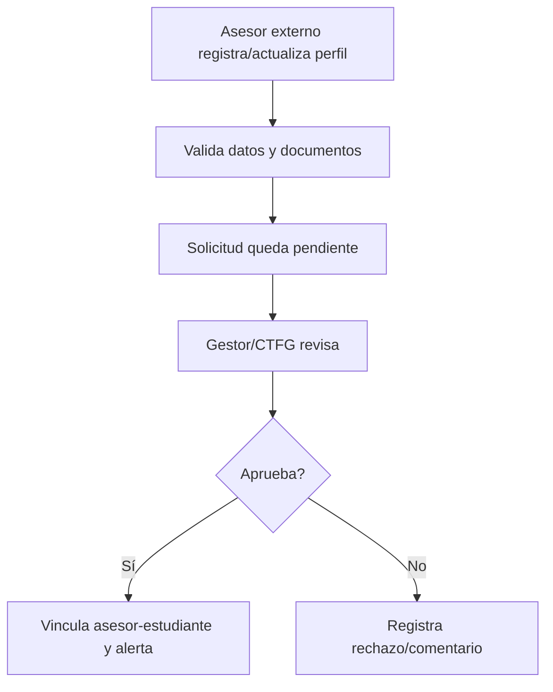

---

### 4.14 Módulo: Google Calendar

| Campo | Detalle |
|---|---|
| Propósito | Permitir conexión OAuth de usuarios con Google Calendar y sincronizar eventos académicos. |
| Archivos principales | `auth/google_auth.php`, `auth/google_callback.php`, `auth/disconnect_google.php`, `service/GoogleCalendarService.php`, `documentation/GOOGLE_CALENDAR.md`. |
| Rutas/endpoints | `auth/google_auth.php`, `auth/google_callback.php`, `auth/disconnect_google.php`. |
| Servicios involucrados | `Service\GoogleCalendarService`, `google/apiclient`. |
| Entidades/modelos | `google_calendar_tokens`, `google_calendar_sync_log`; configuración `$google_calendar_config` en `config.inc`. |
| Responsabilidades | Crear URL OAuth; procesar callback; cifrar/descifrar tokens; guardar tokens; desconectar usuario; crear/actualizar eventos; registrar sincronizaciones. |
| Validaciones | Sesión; presencia de `code` en callback; configuración de client ID/secret/redirect/key; expiración/token refresh cuando aplica. |
| Errores manejados | Redirect a perfil con estado de error; `error_log` dentro del servicio; excepciones al cifrar/descifrar tokens. |
| Dependencias internas | `vendor/autoload.php`, `config.inc`, `inc/db/bdcommon.inc`, `mod/login/check.php`. |
| Observaciones técnicas | Buen encapsulamiento comparado con otros módulos. Debe asegurarse que `GOOGLE_TOKEN_CIPHER_KEY` sea obligatorio y no vacío en producción. |

**Flujo funcional sugerido**

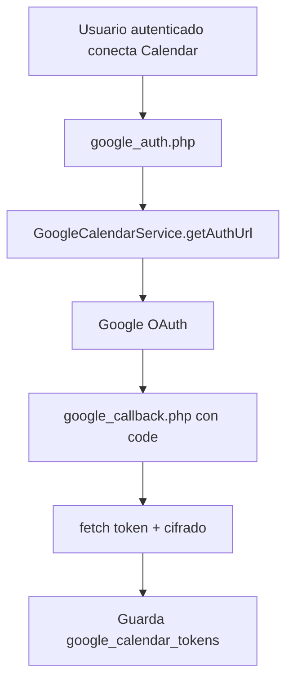

---

### 4.15 Módulo: Reportes y resúmenes

| Campo | Detalle |
|---|---|
| Propósito | Generar reportes académicos, resúmenes de estudiante y reportes de prórrogas en pantalla/PDF. |
| Archivos principales | `panel_student_summary.php`, `mod/admin/users/student_summary_queries.php`, `student_summary_service.php`, `student_summary_pdf.php`, `download_student_summary_pdf.php`, `panel_reporte_prorrogas.php`, `prorroga_report_queries.php`, `prorroga_report_service.php`, `prorroga_report_pdf.php`, `descargar_reporte_prorrogas.php`. |
| Rutas/endpoints | Paneles de resumen/reporte; descargas PDF bajo `mod/admin/users/`. |
| Servicios involucrados | `student_summary_service.php`, `prorroga_report_service.php`, clases PDF con FPDF. |
| Entidades/modelos | `sis_user`, `tfg_proposals`, `registered_projects`, `project_members`, `tfg_extension_requests`, `tfg_final_documents`, `project_history`. |
| Responsabilidades | Consultar datos consolidados; formatear reportes; generar PDF; descargar archivos. |
| Validaciones | Sesión/rol; ID de estudiante/proyecto; filtros de fecha/estado; disponibilidad de datos. |
| Errores manejados | Mensajes de datos no disponibles; errores de PDF/descarga; retornos vacíos en consultas. |
| Dependencias internas | FPDF, consultas MySQL, `mod/login/check.php`, helpers de reporte. |
| Observaciones técnicas | Conviene separar completamente consulta, ensamblado de DTO y render PDF para facilitar pruebas y evitar duplicidad. |

**Flujo funcional sugerido**

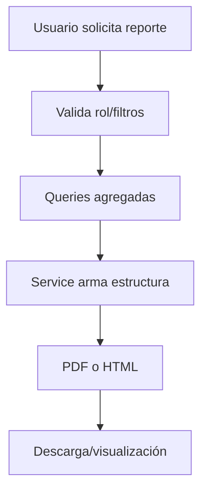

---

### 4.16 Módulo: Cancelación de proyectos

| Campo | Detalle |
|---|---|
| Propósito | Cancelar proyectos aprobados bajo reglas de negocio, registrar acuerdo y actualizar estados relacionados. |
| Archivos principales | `cancelar_proyecto_aprobado.php`, `service/cancelaciones/CancelacionProyectoService.php`, `CancelacionProyectoValidator.php`, `CancelacionProyectoRules.php`, `CancelacionProyectoRepositoryInterface.php`, pruebas `tests/unit/cancelacion/*`, `tests/functional/HUCancelacionProyectosCest.php`. |
| Rutas/endpoints | `cancelar_proyecto_aprobado.php`. |
| Servicios involucrados | `CancelacionProyectoService`, `CancelacionProyectoValidator`, `CancelacionProyectoRules`, contrato de repositorio. |
| Entidades/modelos | `proyecto_aprobado`, `acuerdo_cancelacion`, `tfg_proposals`, posiblemente `registered_projects`. |
| Responsabilidades | Validar entrada; verificar proyecto cancelable; impedir doble cancelación; validar seis meses sin avances; insertar acuerdo; marcar proyecto/propuesta como cancelada. |
| Validaciones | Proyecto ID positivo; motivo requerido y máximo 500; sesión válida; proyecto existente/no cancelado; existencia de cancelación previa; fecha último avance; regla de seis meses. |
| Errores manejados | Arreglo `ok/errores`; rollback ante excepción; redirección con mensajes en controlador legacy. |
| Dependencias internas | Servicio de cancelación, repositorio implementado/adaptado en controlador, DB, pruebas unitarias y funcionales. |
| Observaciones técnicas | Es el mejor candidato como ejemplo de modernización incremental porque separa servicio, validador y contrato. Falta generalizar este patrón a otros módulos críticos. |

**Flujo funcional sugerido**

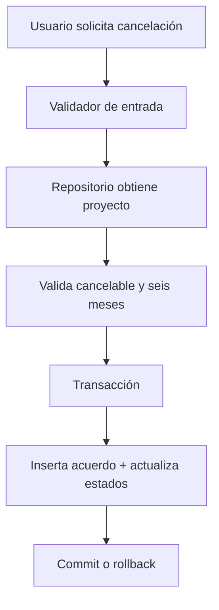

---

### 4.17 Módulo: Correo transaccional

| Campo | Detalle |
|---|---|
| Propósito | Enviar correos del sistema para notificaciones, documentos TFG, recuperación y comunicaciones institucionales. |
| Archivos principales | `inc/email_helper.php`, `inc/email_template_helper.php`, `mod/admin/users/send_tfg_mail.php`, `send_defense_agreement_mail.php`, `defense_agreement_mail_helper.php`, `test_mail.php`, `test_mail_simple.php`, `docker/msmtp/msmtprc`. |
| Rutas/endpoints | Scripts de envío bajo `mod/admin/users/`; scripts de prueba de correo; procesos que llaman email helper. |
| Servicios involucrados | PHPMailer vía Composer; helpers de email/template. |
| Entidades/modelos | `sis_user`, `user_alerts`, entidades de TFG/documentos según correo enviado. |
| Responsabilidades | Construir HTML de correo; definir remitente/responder; enviar correo; probar configuración SMTP/msmtp; notificar documentos/acuerdos. |
| Validaciones | Dirección de correo destino; configuración SMTP; datos mínimos del mensaje; archivos adjuntos cuando aplica. |
| Errores manejados | Resultados de PHPMailer; scripts de prueba; logs; fallback según configuración. |
| Dependencias internas | `config.inc`, Composer `phpmailer/phpmailer`, plantillas HTML, msmtp/Docker. |
| Observaciones técnicas | Debe evitarse exponer detalles SMTP al usuario final. En producción, credenciales deben venir de variables de entorno o secretos, nunca de archivos versionados. |

**Flujo funcional sugerido**

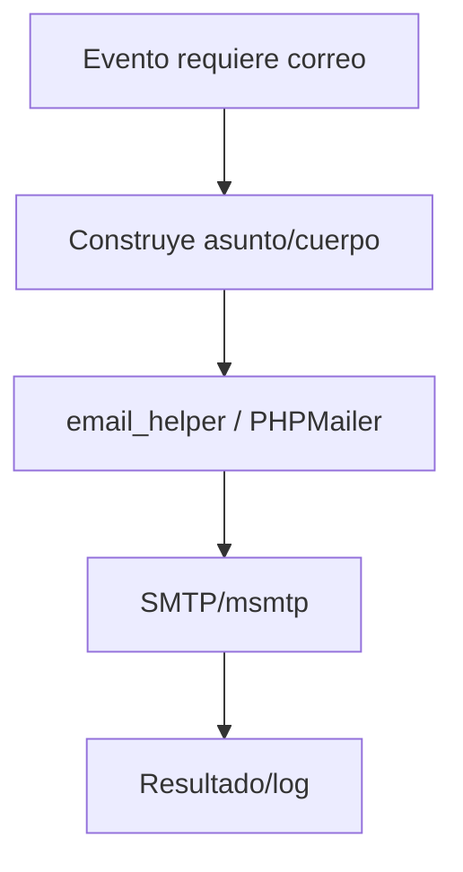

---

## 5. Dependencias transversales entre módulos

| Dependencia | Usada por | Riesgo si falla |
|---|---|---|
| `mod/login/check.php` | Casi todos los módulos protegidos. | Acceso no autenticado o redirecciones incorrectas. |
| `inc/db/bdcommon.inc` / `inc/db/db.php` | Todos los módulos con BD. | Caída global de funcionalidades; errores SQL. |
| `config.inc` | Login, rutas, LDAP, correo, Google Calendar, módulos/acciones. | Rutas mal calculadas, LDAP/correo/Calendar inoperantes. |
| `inc/constants.php` | TFG, chat, roles, archivos, estados. | Estados inconsistentes o validaciones divergentes. |
| `inc/alert_functions.php` | TFG, prórrogas, asesor externo, deadlines, seguridad. | Usuarios no reciben alertas críticas. |
| `inc/upload_helpers.php` | Propuestas y documentos finales. | Riesgo de archivos inválidos o duplicación de validación. |
| `vendor/autoload.php` | Google Calendar, PHPMailer, pruebas, PDF según módulo. | Integraciones externas dejan de funcionar. |
| `base.sql` | Todo el sistema. | Mismatch esquema-código causa errores runtime. |

---

## 6. Observaciones técnicas globales

| Hallazgo | Impacto | Recomendación |
|---|---|---|
| Módulos con estilos distintos | Onboarding más difícil y cambios más riesgosos. | Mantener fichas por módulo y usar patrón objetivo incremental en cambios nuevos. |
| Algunos paneles consultan tablas no confirmadas en `base.sql` | Posibles errores runtime o funcionalidades incompletas. | Validar esquema real de producción y crear migraciones o corregir consultas. |
| Uso mixto de SQL concatenado y prepared statements | Riesgo de inyección y bugs por escaping. | Prepared statements obligatorios para entradas externas. |
| Validación de sesión/rol dispersa | Riesgo de endpoints sin autorización suficiente. | Crear helper común para `require_auth`, `require_role`, `require_permiso`. |
| Respuestas mixtas HTML/JSON/códigos simples | Frontend y pruebas se complican. | Estandarizar endpoints AJAX con contrato JSON. |
| Archivos/documentos sensibles | Riesgo de acceso indebido o fuga de datos. | Revisar permisos de descarga, rutas y logs; aplicar mínimo privilegio. |
| Ausencia de migraciones formales | Drift entre local, pruebas y producción. | Introducir migraciones incrementales numeradas en `base/sql/` o equivalente. |

---

## 7. Diagramas de flujo sugeridos para el manual formal

| Diagrama | Módulos incluidos | Objetivo |
|---|---|---|
| Flujo de autenticación y autorización | Acceso, roles, permisos, paneles | Mostrar login, sesión, rol y carga de menú. |
| Flujo completo de propuesta TFG | Propuestas, usuarios, archivos, notificaciones | Explicar desde carga hasta estado inicial de revisión. |
| Flujo de documento final | Documentos finales, asesor, CTFG, alertas, correo | Explicar revisión, corrección y aprobación/rechazo. |
| Flujo de prórroga | Prórrogas, reportes, deadlines | Documentar solicitud, aprobación y cambio de fechas. |
| Flujo documental formal | Plantillas, actas, minutas, acuerdos, descargas | Mostrar generación/carga/descarga de documentos institucionales. |
| Flujo de comunicación | Chat, notificaciones, correo | Diferenciar alertas internas, chat y correo transaccional. |
| Flujo de archivo/cancelación | Archivo histórico, cancelaciones, estados TFG | Mostrar ciclo de vida final del proyecto. |
| Flujo de integraciones externas | LDAP, SMTP, Google Calendar | Mostrar puntos de fallo y configuración necesaria. |

---

## 8. Checklist para completar el capítulo en la versión formal

- [ ] Confirmar con usuario/equipo el nombre oficial de cada rol.
- [ ] Validar si las tablas referenciadas por paneles (`tfg_meetings`, `tfg_observaciones`, `tfg_commission_meetings`, `tfg_announcements`, `tfg_evaluations`) existen en producción o son deuda/legacy.
- [ ] Completar diccionario de datos por tabla en el capítulo de base de datos.
- [ ] Asociar cada endpoint a permisos concretos (`mod`, `act`, `rol`) donde aplique.
- [ ] Añadir capturas de pantalla por módulo cuando el usuario las aporte.
- [ ] Ejecutar suites de pruebas y mapear cada prueba a su módulo.
- [ ] Identificar endpoints sin `check.php` o sin validación explícita de rol.
- [ ] Revisar seguridad de descargas y uploads por módulo.
- [ ] Definir contratos JSON para endpoints AJAX más usados.

---

## 9. Conclusión de la etapa 3

La documentación por módulos confirma que SGPFL es un monolito funcionalmente amplio y parcialmente modularizado. Los módulos más cohesionados son `chat`, `plantillas`, `Google Calendar` y `cancelaciones`; los más críticos y complejos son autenticación, propuestas TFG, documentos finales, prórrogas y paneles por rol.

Para el manual formal, estas fichas deben convertirse en capítulos ampliados con capturas, diagramas finales, diccionario de datos y trazabilidad de permisos. La recomendación técnica es mantener el sistema como monolito modular, pero estandarizar los nuevos cambios alrededor de controladores pequeños, validadores, servicios de aplicación, repositorios/prepared statements, contratos JSON y pruebas por módulo.
